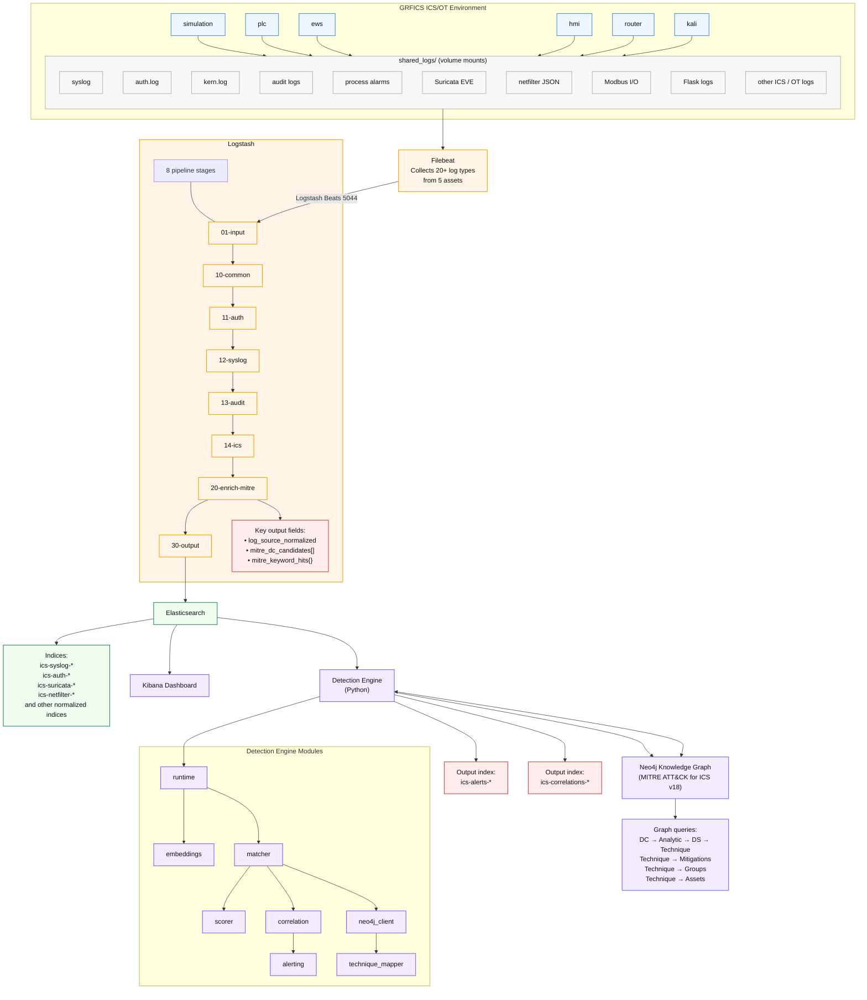

# ICS Detection and Correlation Engine — Design Document

## 1. Architecture Overview



### Data Flow

1. **Collection**: Filebeat reads 20+ log types from GRFICS containers into `shared_logs/`.
2. **Parsing**: Logstash normalises fields and sets `log_source_normalized`.
3. **Enrichment**: Logstash maps `log_source_normalized` → `mitre_dc_candidates[]` using `log_source_to_dc.yml`, then tags `mitre_keyword_hits{}` via a Ruby filter.
4. **Storage**: Events are indexed in Elasticsearch under `ics-*` patterns.
5. **Detection**: The engine polls Elasticsearch, normalises hits to `NormalizedEvent`, builds **embedding text** (log message + key fields), and runs a **two-tier** pipeline: (a) **candidate gate** — keep a DataComponent if Logstash enrichment / log-source name matches *or* semantic cosine similarity exceeds a threshold; (b) **composite score** — weighted combination of semantic, log-source, keyword, field, and category signals.
6. **Embeddings**: At startup, each DataComponent’s **embedding text** (JSON `description` + non-trivial `log_sources[].Channel` strings) is encoded once and cached. Each event’s embedding text is encoded at match time (when `embeddings.enabled` is true and `sentence-transformers` is installed).
7. **Technique mapping**: Neo4j graph traversal (when enabled) identifies probable MITRE ATT&CK for ICS techniques; otherwise a Caldera-derived fallback map is used.
8. **Correlation**: Temporal grouping with chain-step boosting and **exponential decay** on correlation boosts.
9. **Alerting**: Explainable alerts are written to `ics-alerts-*` and group summaries to `ics-correlations-*`.

Optional **Docker** service: `detection-engine` in `docker-compose.yml` runs `python -m engine` with config and datacomponents mounted; it depends on Elasticsearch being healthy.

---

## 2. Scoring Model

### 2.1 Two-Tier Pipeline

**Tier 1 — Candidate gate**

A DataComponent is scored only if **at least one** of the following holds:

| Gate | Condition |
|------|-----------|
| **Logstash enrichment** | `dc.id ∈ event.mitre_dc_candidates` |
| **Log-source name** | `log_source_normalized` equals a DC `log_sources[].Name`, or shares the same prefix before `:` (e.g. `linux:auth` vs `linux:syslog`) |
| **Semantic** | Cosine similarity between the event embedding and the DC embedding ≥ `semantic_gate_threshold` (default **0.25**) |

This avoids scoring all 36 DataComponents on every log when embeddings are available; when embeddings are disabled, log-source and enrichment gates still apply.

**Tier 2 — Composite similarity**

```
S(event, dc) = w_sem · S_sem + w_ls · S_ls + w_kw · S_kw + w_fld · S_fld + w_cat · S_cat
```

Default weights (see `config/detection.yml`):

| Signal | Key | Weight | Description | Range |
|--------|-----|--------|-------------|-------|
| **Semantic** | `semantic_match` | **0.40** | Cosine similarity between embeddings of event text vs. DC text (description + channels) | [0, 1] |
| **Log source** | `log_source_match` | **0.25** | Graduated match: enrichment or exact name → 1.0; same prefix before `:` → 0.8; same **family** (e.g. `ics:suricata_*`) → 0.5 | [0, 1] |
| **Keyword** | `keyword_match` | **0.15** | `\|K_hit\| / \|K_profile\|` with optional IDF-style scaling on DC document frequency | [0, 1] |
| **Field** | `field_match` | **0.10** | Jaccard similarity of event field keys vs. DC profile fields and `ICS_FIELD_MAP` overrides | [0, 1] |
| **Category** | `category_match` | **0.10** | Jaccard similarity of inferred categories vs. DC `searchable_indexes.categories` | [0, 1] |

The legacy **channel token-ratio** signal (`S_ch`) is **replaced** by **semantic similarity** (`S_sem`), which compares full natural-language channel text (embedded with the DC description) against the event embedding text.

### 2.2 Signal Details

**Semantic match (S_sem)**

- **DC side**: Built in `dc_loader.build_dc_embedding_text()` — concatenation of the DataComponent `description` and each non-placeholder `Channel` string (deduplicated, truncated for safety).
- **Event side**: Built in `feature_extractor.build_embedding_text()` — `log_source_normalized`, `log_message`, and a fixed set of salient field keys (`auth_user`, `src_ip`, `alert.signature`, etc.).
- **Model**: Default `BAAI/bge-small-en-v1.5` via `sentence-transformers`; vectors are L2-normalised; cosine similarity equals dot product.

**Log source match (S_ls)**

- Primary: `dc.id ∈ mitre_dc_candidates` → 1.0 with evidence `logstash_enrichment:...`.
- Exact match on `log_source_normalized` vs. a DC log source name → 1.0.
- Prefix match (same component before `:`) → 0.8.
- **Family** match via `LOG_SOURCE_FAMILIES` in `scorer.py` (e.g. all `ics:suricata_*` map to `network_ids`) → 0.5.

**Keyword match (S_kw)**

- If Logstash provides `mitre_keyword_hits[dc_id]`, overlap is measured against the DC keyword list.
- Otherwise, substring match in normalised event text; keywords shorter than three characters are ignored to reduce noise.
- Optional IDF-style weight when DC document frequencies are configured on the scorer.

**Field match (S_fld)**

- `ICS_FIELD_MAP` in `matcher.py` supplies ICS-tailored field names per DC where the generic MITRE field list is weak for GRFICS.
- Jaccard: `|F_event ∩ F_dc| / |F_event ∪ F_dc|`.

**Category match (S_cat)**

- Categories are inferred in `feature_extractor.infer_categories()` with a **reduced** rule set compared to earlier versions, to limit over-broad triggers.
- Jaccard against DC profile categories.

### 2.3 Thresholds

| Threshold | Default | Purpose |
|-----------|---------|---------|
| `candidate_threshold` | **0.30** | Minimum composite `S` to retain a `CandidateMatch` |
| `alert_threshold` | **0.55** | Minimum score (after asset penalty if applicable) to emit an alert |
| `high_confidence_threshold` | **0.80** | Score at or above → `confidence_tier: high` |
| `unknown_asset_penalty` | **0.05** | Subtracted from similarity when `asset_id` is unknown |
| `semantic_gate_threshold` | **0.25** | Minimum cosine similarity for the **semantic gate** (Tier 1) |

---

## 3. Knowledge Graph Integration

### 3.1 Neo4j Schema (v18)

The MITRE ATT&CK for ICS v18 knowledge graph contains:

- **410 nodes** across 10 labels: Technique (83), Tactic (12), Software (23), Group (14), Campaign (7), Asset (18), Mitigation (52), DataComponent (36), Analytic (82), DetectionStrategy (83)
- **~1500 relationships** of 7 types: USES, MITIGATES, DETECTS, TARGETS, ATTRIBUTED_TO, CONTAINS, ASSOCIATED_WITH

### 3.2 DC → Technique Traversal

There is no direct edge from DataComponent to Technique. The path is:

```
DataComponent ←[USES]← Analytic ←[CONTAINS]← DetectionStrategy →[DETECTS]→ Technique
```

The engine pre-loads traversals at startup and caches them in `neo4j_client.py`.

### 3.3 Technique Probability Model

For each technique `t` reachable from a DataComponent `dc`:

```
raw(t) = path_weight(dc→t) × (1 + α_group × norm_group(t))
                             × (1 + α_asset × asset_relevance(t, event))

P(t | dc, event) = raw(t) / Σ_t' raw(t')
```

Where:

- `path_weight`: number of distinct Analytic nodes linking `dc` to `t`
- `norm_group`: `group_count(t) / max_group_count` across candidates
- `asset_relevance`: 1.0 if the technique targets a MITRE Asset compatible with the GRFICS asset role (e.g. PLC → “Programmable Logic Controller”)
- Defaults: `α_group = 0.3`, `α_asset = 0.5` (configurable under `technique_mapper`)

### 3.4 Fallback Mode

When Neo4j is unavailable or disabled, the engine uses a hardcoded DC → technique fallback map in `runtime.py` so alerts still receive primary technique attribution.

---

## 4. Correlation Model

### 4.1 Temporal Grouping

Events are grouped when:

- They fall within a configurable time window (default **300 seconds**), and
- They match the same or compatible correlation group, with preference for same `asset_id` and for known chain progressions.

**Cross-asset**: Network-oriented DataComponents (`DC0078`, `DC0082`, `DC0085`) may correlate across assets (e.g. router traffic with PLC-side events).

### 4.2 Chain-Step Boosting

70+ static rules in `correlation.CHAIN_RULES` encode expected ICS progressions, including **SSH / lateral** style pairs aligned with documented GRFICS Caldera chains (e.g. credential access → network content → process alarm). When a new match extends a chain (`(prev_dc, cur_dc)` in the rule set and `cur_dc` not yet in the chain list), `chain_step_boost` (default **0.12**) is applied.

### 4.3 Temporal Decay

Correlation and repeat boosts are multiplied by an exponential decay based on time since the group’s last event:

```
decay = exp(-0.693 × Δt / decay_half_life_seconds)
```

Default `decay_half_life_seconds` is **120**. This reduces stale groups inflating scores.

### 4.4 Repeat Escalation

If the same DataComponent appears at least `repeat_count_escalation` times (default **3**) within a group, an extra per-event boost is applied (capped by `max_correlation_boost`).

---

## 5. Alert Structure

Each alert includes similarity breakdown, **semantic score**, **gate reason**, and graph-backed technique fields:

```json
{
  "detection_id": "uuid",
  "timestamp": "ISO8601",
  "datacomponent": "Process/Event Alarm",
  "datacomponent_id": "DC0109",
  "asset_id": "plc",
  "asset_name": "PLC Controller",
  "asset_ip": "192.168.95.2",
  "zone": "ics-net",
  "is_ics_asset": true,
  "similarity_score": 0.72,
  "confidence_tier": "high",
  "signal_scores": {
    "semantic_match": 0.69,
    "log_source_match": 1.0,
    "keyword_match": 0.12,
    "field_match": 0.29,
    "category_match": 0.5
  },
  "matched_keywords": ["trip", "interlock"],
  "matched_categories": ["operational_technology", "safety"],
  "matched_log_source": "logstash_enrichment:ics:plc_app->DC0109",
  "matched_channel": "semantic_cosine:0.6885",
  "semantic_score": 0.6885,
  "gate_reason": "semantic:0.689",
  "technique": {
    "technique_id": "T0831",
    "technique_name": "Manipulation of Control",
    "probability": 0.42,
    "tactics": ["Impair Process Control"],
    "mitigations": [{"id": "M0953", "name": "..."}],
    "groups": ["XENOTIME"],
    "graph_path": "DataComponent(DC0109) <-[USES]- Analytic(AN1234) ...",
    "reasoning": "Technique T0831 is reachable via 3 analytics..."
  },
  "correlation_group_id": "uuid",
  "chain_ids": ["DC0085", "DC0109"],
  "chain_depth": 2,
  "technique_sequence": ["T0861", "T0831"]
}
```

Elasticsearch mappings for `ics-alerts-*` include `semantic_score` (float) and `gate_reason` (keyword); see `engine/templates.py`.

---

## 6. Module Summary

| Module | File | Purpose |
|--------|------|---------|
| **Runtime** | `engine/runtime.py` | Stream / oneshot / backtest loops; builds `EmbeddingEngine`, matcher, correlation, alerting; `--no-embeddings` and `--no-graph` flags |
| **Config** | `engine/config.py` | YAML loader: thresholds, weights, Elasticsearch, Neo4j, **embeddings** |
| **Models** | `engine/models.py` | `NormalizedEvent`, `DataComponentProfile`, `CandidateMatch`, `DetectionAlert`, etc. |
| **Embeddings** | `engine/embeddings.py` | `sentence-transformers` wrapper; DC embedding cache; cosine similarity |
| **Feature extractor** | `engine/feature_extractor.py` | ES hit → `NormalizedEvent`; `build_embedding_text`; `infer_categories` |
| **DC loader** | `engine/dc_loader.py` | Load DC JSON; `build_dc_embedding_text` |
| **Scorer** | `engine/scorer.py` | Graduated log-source, keyword, field, category; composite weights |
| **Matcher** | `engine/matcher.py` | Tier-1 gate + Tier-2 scoring; `ICS_FIELD_MAP` |
| **Correlation** | `engine/correlation.py` | Temporal groups, chain rules, decay |
| **Neo4j client** | `engine/neo4j_client.py` | Bolt connection; DC→technique cache |
| **Technique mapper** | `engine/technique_mapper.py` | DC → technique probabilities |
| **Alerting** | `engine/alerting.py` | Alert documents and suppression |
| **ES client** | `engine/es_client.py` | Polling, checkpoints, indexing |
| **Templates** | `engine/templates.py` | Index templates for alerts and correlations |
| **Container** | `engine/Dockerfile` | Optional image: Python 3.11, requirements, model pre-download |

---

## 7. DataComponent Coverage

### ICS-Specific Log Sources and Mapped DCs

| Log Source | Container | `log_source_normalized` | Primary DCs |
|-----------|-----------|------------------------|-------------|
| Suricata IDS | router | `ics:suricata_*` | DC0078, DC0082, DC0085 |
| ulogd/netfilter | router | `ics:netfilter` | DC0078, DC0082 |
| Process alarms | simulation | `ics:process_alarm` | DC0109, DC0108 |
| Modbus I/O | simulation | `ics:modbus_io` | DC0109, DC0078, DC0085, DC0107 |
| OpenPLC app | plc | `ics:plc_app` | DC0109, DC0038, DC0108 |
| ScadaLTS/Tomcat | hmi | `hmi:catalina` | DC0038, DC0109 |
| Flask firewall UI | router | `ics:fw_app` | DC0038, DC0061 |
| TE simulation | simulation | `ics:sim_process` | DC0107, DC0109, DC0038 |
| Simulation errors | simulation | `ics:sim_error` | DC0108, DC0109 |
| Auth logs (all) | all | `linux:auth` | DC0002, DC0067 |
| Syslog (all) | all | `linux:syslog` | DC0032, DC0033, DC0038, … |
| Kernel logs | all | `linux:kern` | DC0004, DC0016, DC0042 |
| Daemon logs | plc, hmi | `linux:daemon` | DC0033, DC0060, DC0041 |
| Process acct | ews | `linux:pacct` | DC0107, DC0032 |
| Docker stdout | all | `docker:runtime` | DC0032, DC0033, DC0038, DC0064 |

Exact `log_source_normalized` values depend on the Logstash pipeline; the **semantic gate** helps when enrichment or string match alone is incomplete.

### Caldera Attack Chain → DC Mapping

| Chain | Technique | Expected DC |
|-------|-----------|-------------|
| 1: Pressure Manipulation | T0846, T0888, T0861, T0801, T0831 | DC0078, DC0085, DC0107, DC0109 |
| 2: PLC Logic Replacement | T0812, T0845, T0889 | DC0067, DC0038, DC0061, DC0109 |
| 3: HMI Compromise | T0812, T0846, T0831 | DC0067, DC0038, DC0109 |
| 4: Safety System Defeat | T0861, T0821 | DC0085, DC0109, DC0108 |
| 5: EWS Pivot | T0840, T0893, T0867, T0877, T0835 | DC0078, DC0032, DC0085, DC0109 |
| 6: Rogue Modbus Master | T0868, T0836, T0806, T0814 | DC0085, DC0078, DC0109, DC0108 |
| 7: HMI View/Alarms | T0871, T0802, T0838, T0832 | DC0038, DC0109, DC0107 |
| 8: Network Sabotage | T0812, T0881, T0872, T0803, T0804 | DC0067, DC0078, DC0033, DC0085 |
| 9: PLC Mode/Destruction | T0868, T0858, T0845, T0809, T0849 | DC0038, DC0109, DC0061, DC0108 |
| 10: Full Campaign | Multiple | All of the above |
| 11–13: SSH foothold on EWS | T0866, T0867, T0801, T0831, T0886, T0893, T0822, … | DC0067, DC0085, DC0109, DC0038, DC0032, … |

---

## 8. Configuration Reference

### `config/detection.yml`

```yaml
thresholds:
  candidate_threshold: 0.30
  alert_threshold: 0.55
  high_confidence_threshold: 0.80
  unknown_asset_penalty: 0.05

correlation:
  window_seconds: 300
  repeat_count_escalation: 3
  max_correlation_boost: 0.20
  per_event_correlation_boost: 0.05
  chain_step_boost: 0.12
  decay_half_life_seconds: 120.0

scoring_weights:
  semantic_match: 0.40
  log_source_match: 0.25
  keyword_match: 0.15
  field_match: 0.10
  category_match: 0.10

embeddings:
  enabled: true
  model: "BAAI/bge-small-en-v1.5"
  device: "cpu"
  semantic_gate_threshold: 0.25

neo4j:
  enabled: false
  uri: "bolt://localhost:7687"
  username: "neo4j"
  password: "secret"
  cache_ttl_seconds: 3600

technique_mapper:
  alpha_group: 0.3
  alpha_asset: 0.5
  max_candidates: 5

elasticsearch:
  hosts: ["http://localhost:9200"]
  source_index_pattern: "ics-*"
  alert_index_pattern: "ics-alerts-%Y.%m.%d"
  correlation_index_pattern: "ics-correlations-%Y.%m.%d"
```

**CLI**: `python -m engine --config config/detection.yml --mode stream|oneshot|backtest`  
Optional: `--no-graph` (disable Neo4j), `--no-embeddings` (skip the embedding model; semantic scores stay 0 and gating relies on enrichment/log-source rules), `--bootstrap-templates` (install ES index templates).

---

## 9. Assumptions and Limitations

1. **Neo4j availability**: With `neo4j.enabled: false` or an unreachable broker, technique attribution uses the fallback map; full graph features require a loaded v18 database.

2. **Embeddings dependency**: Full semantic scoring requires `sentence-transformers` (and typically `torch`). If the package is missing or `--no-embeddings` is set, `S_sem` is zero and Tier-1 **semantic gate** does not pass on similarity alone — enrichment and log-source gates remain.

3. **Logstash enrichment**: `mitre_dc_candidates` remains a strong signal for `S_ls` and gating. Sparse mapping in `log_source_to_dc.yml` is partially offset by semantic similarity and family matching.

4. **Docker networking blind spot**: Intra-ICS Modbus traffic between simulation and PLC may not appear in Suricata; detection still relies on host and application logs (`ics:plc_app`, `ics:process_alarm`, etc.).

5. **DC profile bias**: MITRE DataComponent JSON mixes enterprise and ICS sources; embedding text and `ICS_FIELD_MAP` align the matcher with GRFICS field names and narratives.

6. **Chain rules are static**: Correlation rules are hand-maintained; future work could derive sequences from the knowledge graph or labelled exercises.

---

## 10. Recommended Next Steps

1. **Deploy Neo4j**: Load the v18 graph (`mitre_ics_matrix_v18_to_kg.py` and complementary relationship scripts as needed) and set `neo4j.enabled: true`.

2. **Tune thresholds**: After running Caldera chains, adjust `alert_threshold`, `semantic_gate_threshold`, and weights for precision/recall on your index mix.

3. **Operational embedding model**: For higher accuracy at higher cost, set `embeddings.model` to `BAAI/bge-m3` (update memory/CPU expectations).

4. **Suricata and PLC rules**: Add GRFICS-specific IDS rules to enrich `ics:suricata_*` and `ics:modbus_io` events.

5. **Kibana**: Dashboard alert volume, `gate_reason`, `semantic_score`, and technique distribution.

6. **Dynamic chain rules**: Optionally mine technique sequences from Neo4j groups/campaigns to extend `CHAIN_RULES`.

---

## 11. References

1. MITRE ATT&CK for ICS v18: https://attack.mitre.org/versions/v18/matrices/ics/
2. Jaccard similarity: Jaccard, P. (1912). “The distribution of the flora in the alpine zone.”
3. Reimers & Gurevych (2019). “Sentence-BERT: Sentence Embeddings using Siamese BERT-Networks.” (family of approaches underlying `sentence-transformers`)
4. BGE embeddings: BAAI/bge-small-en-v1.5 / BGE-M3 model cards (Beijing Academy of Artificial Intelligence)
5. GRFICS: Formby, D. et al. (2018). “GRFICS: A Graphical Realism Framework for ICS.”
6. Caldera for OT: MITRE (2023). “Caldera for OT.”
