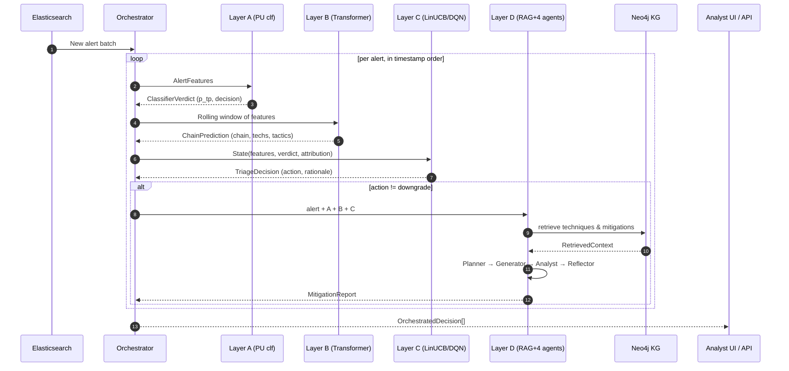
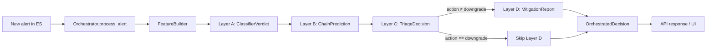
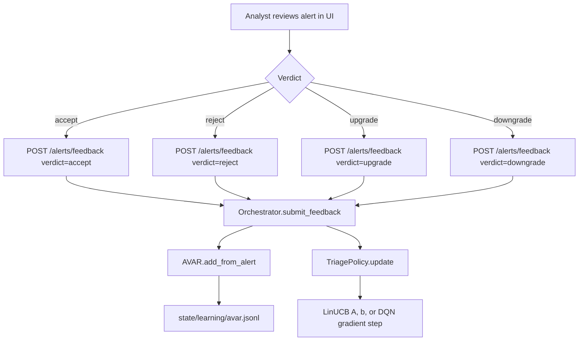

# Learning-Enhanced ICS Detection and Mitigation Recommendation — Design and Implementation

*Technical design and implementation reference for the `learning/` package
that augments the **MITRE ATT&CK for ICS Detection and Correlation
Engine** with adaptive classification, attack-chain attribution, analyst-
guided alert triage, and knowledge-graph-grounded mitigation recommendation.*

---

## Document scope

This document is the **engineering counterpart** to the earlier feasibility
study (`docs/Learning-Enhanced ICS Detection and Mitigation
Recommendation.md`). Where that report justifies the choice of learning
paradigms, this one:

1. Explains the **conception** of the component — objectives, guarantees,
   architectural decisions, and how it fits alongside the deterministic
   detection engine.
2. Explains the **implementation** — module layout, data flow,
   configuration, persistence format, APIs, and operational workflows.
3. Serves as a reference for reproducing, extending, or evaluating the
   component in an academic setting (graduation / final-year project).

The reader is assumed to be familiar with ICS security terminology,
MITRE ATT&CK for ICS, and basic machine learning vocabulary
(classification, Transformer, bandit, RAG, LLM).

---

## Table of contents

1. [Motivation and objectives](#1-motivation-and-objectives)
2. [Design principles](#2-design-principles)
3. [High-level architecture](#3-high-level-architecture)
4. [Integration with the detection and correlation engine](#4-integration-with-the-detection-and-correlation-engine)
5. [End-to-end data flow](#5-end-to-end-data-flow)
6. [Learning approach per layer](#6-learning-approach-per-layer)
7. [Knowledge-graph interaction (Layer D)](#7-knowledge-graph-interaction-layer-d)
8. [Mitigation generation, selection, and contextualisation](#8-mitigation-generation-selection-and-contextualisation)
9. [Implementation reference](#9-implementation-reference)
10. [Configuration reference](#10-configuration-reference)
11. [Operational workflows](#11-operational-workflows)
12. [Evaluation methodology](#12-evaluation-methodology)
13. [Assumptions, limitations, and design decisions](#13-assumptions-limitations-and-design-decisions)
14. [Threat model and safety analysis](#14-threat-model-and-safety-analysis)
15. [Glossary](#15-glossary)
16. [Future work](#16-future-work)

---

## 1. Motivation and objectives

### 1.1. Problem statement

The deterministic detection engine produces alerts whose correctness
depends on handcrafted thresholds and evidence policies. Empirical
testing revealed three recurring failure modes:

| Failure mode | Root cause | Operational impact |
|---|---|---|
| **False positives** under normal load | Alerts fire on benign log bursts whose textual embedding is close to an attack pattern. | Alert fatigue; analysts lose trust in the system. |
| **False negatives** for sub-threshold evidence | Individual events in an attack chain score below `alert_threshold` and never reach correlation. | Attack progression goes undetected until a late, loud step. |
| **Undifferentiated prioritisation** | Every alert is emitted with the same urgency; analysts cannot triage effectively. | Critical attacks drown in noise. |

These problems cannot be solved by tuning more thresholds — they need a
layer that **learns from labelled experience** (benign windows, Caldera-
driven attack windows, and analyst verdicts) and returns corrections.

### 1.2. Objectives

The learning component is designed to meet the following objectives, in
order of priority:

1. **Reduce false positives without sacrificing recall** on known attacks.
2. **Recognise and attribute attack chains** from sequences of low-level
   alerts, even when individual alerts are weak.
3. **Triage alerts** so analysts see high-confidence hits first and
   ambiguous ones are explicitly flagged for review.
4. **Recommend mitigations** that are **grounded in the MITRE ATT&CK for
   ICS knowledge graph** — never invented — and contextualised to the
   affected assets.
5. **Adapt online** to operator feedback and to drift in the underlying
   process (seasonality, maintenance windows, new equipment).
6. **Degrade gracefully** when optional dependencies (`torch`,
   `xgboost`, an LLM, Neo4j) are unavailable, preserving the
   deterministic engine's behaviour.

### 1.3. Non-goals

- Replacing the deterministic detection engine. The learning component
  *augments* it; the engine remains the source of truth for log parsing,
  field extraction, and primary alert generation.
- Actuating the ICS directly. All outputs are advisory; no action
  performed by the learning component modifies field devices or network
  configuration.
- Fully unsupervised operation. The component requires at least coarse
  window labels (a few "under attack" and "benign" windows) to train;
  it is *weakly* supervised, not fully unsupervised.

---

## 2. Design principles

These principles are enforced throughout the code base and the
configuration schema.

| Principle | Consequence in the code |
|---|---|
| **Safety rails are deterministic.** | Learned policies never override high-confidence engine alerts (see `recall_floor_score`, `accept_safety_threshold`, and `ambiguity_band`). |
| **Abstain under uncertainty.** | Layer D returns `abstained = true` when knowledge-graph retrieval is empty rather than hallucinating mitigations. |
| **No environment actions.** | Layer C's action space is purely advisory (`accept`, `defer`, `downgrade`, `upgrade`). |
| **Every learned output is inspectable.** | Each layer emits a JSON record (`classifier_verdict.to_dict()`, `ChainPrediction.to_dict()`, `TriageDecision.to_dict()`, `MitigationReport.to_dict()`) with confidence, rationale, and feature contribution where possible. |
| **Models fail-open, not fail-closed.** | If a model is missing or fails to load, the orchestrator falls back to the engine's similarity score instead of silently dropping alerts. |
| **Heavy dependencies are optional.** | `torch`, `xgboost`, `openai`, and `neo4j` are imported lazily; the package runs with scikit-learn + numpy + pyyaml as the minimum floor. |

---

## 3. High-level architecture

The learning component is organised as four cooperating layers plus an
orchestrator. Each layer addresses one of the objectives from
§1.2 and uses the learning paradigm best suited to it.

```
┌─────────────────────────────────────────────────────────────────────┐
│                     Deterministic Detection Engine                  │
│  (engine/*, already in the repository — unchanged)                  │
└──────────────────────┬──────────────────────────────────────────────┘
                       │ Alerts (ics-alerts-*), raw events (ics-*)
                       ▼
┌─────────────────────────────────────────────────────────────────────┐
│                        learning/orchestrator                        │
│  Per-asset rolling windows · feature extraction · model dispatch    │
└──┬─────────────┬─────────────┬─────────────┬────────────────────────┘
   │             │             │             │
   ▼             ▼             ▼             ▼
┌──────┐   ┌──────────┐  ┌──────────┐  ┌──────────────────┐
│ A    │   │ B        │  │ C        │  │ D                │
│ PU   │   │ Seq /    │  │ Triage   │  │ KG-grounded      │
│ alert│   │ chain    │  │ policy   │  │ multi-agent LLM  │
│ clf. │   │ attrib.  │  │ (DRLHF)  │  │ mitigation       │
└──────┘   └──────────┘  └──────────┘  └──────────────────┘
   │             │             │             │
   ▼             ▼             ▼             ▼
┌─────────────────────────────────────────────────────────────────────┐
│  Outputs: OrchestratedDecision per alert                            │
│  { layer_a, layer_b, layer_c, layer_d, final_action }               │
│  Served over FastAPI + persisted in state/learning/                 │
└─────────────────────────────────────────────────────────────────────┘
```

### 3.1. The four layers in one sentence each

- **Layer A — Alert classifier.** Given one alert, predict the probability
  that it is a true positive, using Positive–Unlabeled (PU) learning
  over operator-labelled time windows.
- **Layer B — Attack-chain attributor.** Given a short per-asset
  sequence of alerts, predict the active chain and attribute MITRE
  techniques and tactics using a causal-window Transformer.
- **Layer C — Triage policy.** Given the outputs of Layers A and B,
  decide whether to `accept`, `defer_to_analyst`, `downgrade`, or
  `upgrade` the alert, with deterministic safety rails.
- **Layer D — Mitigation recommender.** For accepted or deferred
  alerts, retrieve KG-grounded techniques and mitigations and run a
  four-agent LLM pipeline (Planner → Generator → Analyst → Reflector)
  to produce a reviewable report.

### 3.2. Sequence diagram (logical)



---

## 4. Integration with the detection and correlation engine

The learning component is **additive** — it consumes the engine's
outputs and pushes back **advisory** annotations. It never edits the
engine's code paths.

### 4.1. Inputs consumed

| Source | Type | Used by |
|---|---|---|
| `ics-alerts-*` index in Elasticsearch | Normalised `DetectionAlert` docs produced by `engine/alerting.py`. | Layers A, B, C, D (retrieval by `datacomponent`). |
| `ics-*` index | Raw events (optional; only used for training a richer feature set). | Training pipelines. |
| `config/detection.yml` | Engine config; its `technique_mapper.fallback` block provides a DC→technique→tactic map that bootstraps Layer B when Neo4j is offline. | Layer B (vocabulary, tactic map). |
| `engine/neo4j_client.Neo4jClient` | Warm-cached KG driver. | Layer D (re-used directly — no duplicate connector). |
| `Caldera Reports/*_report.json` | Ground-truth attack windows for training. | `learning.data.caldera_loader`. |

### 4.2. Outputs produced

| Destination | Type | Consumer |
|---|---|---|
| HTTP API (`/alerts/score`, `/alerts/batch`, `/alerts/feedback`) | `OrchestratedDecision` JSON. | Analyst UI (AegisRec), SIEM enrichment, downstream playbooks. |
| `state/learning/labels.jsonl` | Append-only window-label store. | Re-training loops. |
| `state/learning/avar.jsonl` | Analyst-Validated Alert Repository. | Layer C policy feedback, offline evaluation. |
| `state/learning/metrics/*.json` & `*.csv` | Per-chain evaluation reports. | Academic / operational reporting. |
| `state/learning/layer_{a,b,c}/*` | Persisted model artefacts. | Reloaded by the orchestrator at startup. |

### 4.3. Operational independence

The learning component can be stopped, retrained, upgraded, or rolled
back with **zero downtime** for the detection engine: the engine keeps
writing alerts to Elasticsearch; when the learning service comes back
online it simply resumes polling from its watermark
(`Orchestrator.last_seen_ts`).

---

## 5. End-to-end data flow

### 5.1. From logs to recommended mitigations

```
[PLC/HMI/SCADA/router logs]
        │ Filebeat
        ▼
[Logstash parsers] ── keyword_tagger.rb, asset_map.rb, log_source_family.rb
        │
        ▼
[Elasticsearch ics-* indices]
        │  polling with checkpoint (engine/es_client.py)
        ▼
[engine/feature_extractor] → NormalizedEvent
        │
        ▼
[engine/matcher] → CandidateMatch (similarity, signals, evidence)
        │
        ▼
[engine/correlation] → correlation-group-aware CandidateMatch
        │
        ▼
[engine/alerting] → DetectionAlert → ics-alerts-*  ────────────┐
                                                               │
   ┌───────────────────────────────────────────────────────────┘
   │                        (re-polled by the learning orchestrator)
   ▼
[learning/data/feature_builder.FeatureBuilder]
        │ 20-dim numeric vector + log text
        ▼
[learning/layer_a] ─► ClassifierVerdict (p_true_positive, decision)
        │
        ▼
[learning/layer_b] ─► ChainPrediction (chain_id, techniques, tactics)
        │
        ▼
[learning/layer_c] ─► TriageDecision (action, rationale, safety rail?)
        │
        ▼
(if action ≠ downgrade)
[learning/layer_d] ─► MitigationReport
   ├── kg_retriever.py   → techniques, mitigations, groups, software, targeted assets
   ├── planner_agent     → investigation plan (JSON)
   ├── generator_agent   → KG-grounded mitigation proposals
   ├── analyst_agent     → safety / operational critique
   └── reflector_agent   → technical + executive narratives
        │
        ▼
[OrchestratedDecision] ─► FastAPI /alerts/score ─► UI / SIEM / playbook
```

### 5.2. The training-data flow

```
Operator or Caldera
        │
        ▼
learning.cli add-label           or   learning.cli import-caldera
        │                                   │
        └───────────────┬───────────────────┘
                        ▼
              state/learning/labels.jsonl
                        │
                        ▼
     learning.data.LabelledDatasetBuilder
     (joins ics-alerts-* with window labels)
                        │
                        ▼
   ┌──────────────┬──────────────┬──────────────┐
   ▼              ▼              ▼              ▼
train-layer-a  train-layer-b  train-layer-c     evaluate
(PU classifier)  (Transformer) (LinUCB/DQN)     (harness)
```

### 5.3. The feedback loop

```
Analyst verdict (UI)
        │
        ▼  POST /alerts/feedback
Orchestrator.submit_feedback()
        │
        ├──► AVAR.add_from_alert() → state/learning/avar.jsonl
        └──► TriagePolicy.update()  (LinUCB / DQN online update)
```

Analyst verdicts serve three purposes simultaneously:

1. They become a **cache** (AVAR) so the same alert fingerprint is
   short-circuited next time.
2. They become **online training data** for the LinUCB/DQN policy.
3. They become **gold labels** for the next offline re-training of
   Layers A and B (via `state/learning/labels.jsonl`).

---

## 6. Learning approach per layer

This section justifies the paradigm chosen for each layer and explains
the specific algorithms used. For deeper academic grounding, see the
companion feasibility study.

### 6.1. Layer A — Positive-Unlabeled (PU) alert classifier

**Paradigm.** Weakly-supervised binary classification with **Positive-
Unlabeled** (PU) correction (Kiryo et al., 2017, *nnPU*).

**Why PU and not supervised.** Window labels are *inclusive*:
everything inside an "under_attack" window is labelled 1, but many
events in that window are routine (logins unrelated to the attack,
heartbeats, Modbus reads). This is textbook PU contamination — the
positive class is noisy with negatives. The nnPU estimator corrects the
loss without requiring clean negatives.

**Algorithm.**

1. Build a 20-dimensional scalar feature vector per alert
   (`FeatureBuilder._build_scalar`): similarity score, semantic match,
   keyword match, log-source match, asset-id match, evidence count,
   keyword hits, correlation membership/aggregate, repeat state,
   asset-role known, DC known, tactic/technique count, log length, hour
   of day, day of week, is-weekend.
2. Sample weights come from `nnpu_sample_weights(y, prior=π)`:
   - `w(pos) = π`
   - `w(unl) = max(1 - π · n⁺/n⁻, 1e-3)`
   - Renormalise so `mean(w) = 1`.
3. Fit a gradient-boosted tree (`xgboost.XGBClassifier` when available,
   `sklearn.ensemble.HistGradientBoostingClassifier` otherwise) on the
   training split.
4. Calibrate probabilities via isotonic regression on a held-out split.
5. At inference time, apply the deterministic **recall floor**: if the
   engine's similarity score is already above `recall_floor_score`,
   accept the alert regardless of the model's verdict.

**Drift.** Each calibrated probability is fed to a Page-Hinkley (or
ADWIN via `river`, if installed) detector. An alarm triggers a model-
card annotation; the operator decides whether to re-train.

**Explainability.** `_top_features` multiplies the tree's global
feature importances with the tanh-normalised feature vector to produce
a cheap, deterministic surrogate for SHAP. This populates the UI's
"Why was this flagged?" panel.

### 6.2. Layer B — Causal-window Transformer chain attributor

**Paradigm.** Supervised multi-task sequence modelling.

**Why Transformer and not LSTM.** Caldera chains can inject long-range
dependencies (a login early in the chain correlates with Modbus writes
ten steps later). Transformers handle this natively, and the causal
window (`causal_window = 8`) keeps memory linear in sequence length —
necessary for streaming inference over a live alert feed.

**Inputs.** A per-asset rolling window (default 600 s / 64 alerts) of
`AlertFeatures`. Tokens combine:

- DataComponent id embedding (`d_model/2`).
- Asset id embedding (`d_model/4`).
- Scalar feature projection (`d_model/4`).
- Time-delta since the first event in the window (minutes).

**Outputs.** Three heads share the pooled representation:

- `chain_logits`        — multi-class over known chain ids.
- `technique_logits`    — multi-label over technique ids.
- `tactic_logits`       — multi-label over tactic ids.
- `token_logits_technique` — per-token technique distribution (reserved
                             for future token-level attribution).

**Hierarchical mask.** A technique is only kept if at least one of its
tactics (from the engine's `technique_mapper.fallback` map) was also
predicted with probability ≥ `tactic_threshold`. This mirrors the
H-TechniqueRAG idea: coarse tactic inference first, fine technique
inference conditioned on it.

**Training objective.** Sum of three losses:

```
L = CE(chain_logits, chain_id)                    (multi-class)
  + BCE(technique_logits, technique_multilabel)   (multi-label)
  + 0.5 · BCE(tactic_logits, tactic_multilabel)   (weak tactic target)
```

### 6.3. Layer C — DRLHF triage policy

**Paradigm.** Contextual bandit (LinUCB) by default; Deep Q-Network
(DQN) optional. Reward shaping follows the DRLHF /HARE pattern (Hoang
& Le, 2025; Sai & Dhaker, 2025).

**Why a bandit, not a full MDP.** The "next state" after an alert is
not meaningfully controlled by the chosen action — whether an analyst
accepts alert *t* does not change the distribution of alert *t + 1*
(aside from minor workload effects, which we model as a reward
penalty). The contextual-bandit framing is therefore correct and has
far better sample efficiency than full DRL (Kalpani et al., 2025).

**Action space.** Advisory only: `accept`, `defer_to_analyst`,
`downgrade`, `upgrade`.

**Reward shape** (configurable in `learning.yml`):

| Situation | Reward |
|---|---|
| Accept, true positive | `+1.0` |
| Accept, false positive | `-1.5` (FP is costlier than FN for analyst trust) |
| Defer, correct to defer | `+0.6` |
| Defer, incorrect to defer | `-0.3` |
| Downgrade, true positive | `-1.0` |
| Downgrade, false positive | `+0.3` |
| Upgrade, true positive | `+0.7` |
| Upgrade, false positive | `-0.7` |
| Any defer | additive `-0.05` workload penalty |

Rewards are scaled by analyst confidence when a verdict exists, to
prevent low-confidence labels from dominating updates.

**Safety rails (deterministic, outside the policy).**

1. **AVAR hit** — if the alert fingerprint is in the analyst-validated
   cache, reuse the recorded verdict.
2. **Accept-safety** — if Layer-A confidence ≥ `accept_safety_threshold`
   (default 0.85), force `accept`.
3. **Ambiguity band** — if Layer-A confidence ∈ [0.45, 0.55], force
   `defer_to_analyst`.

These rails are checked **before** the learned policy is consulted, so
the model can never silently downgrade a high-confidence engine alert.

### 6.4. Layer D — KG-grounded multi-agent LLM mitigation pipeline

**Paradigm.** Retrieval-Augmented Generation (RAG) over the Neo4j KG,
followed by a four-agent decomposition à la IRCopilot / ICSSPulse.

**Why four agents, not one.** A single LLM call mixes planning,
retrieval grounding, and critique, and hallucinates more often.
Splitting the task reduces hallucinations because each agent has a
narrower remit and can be asked to abstain when its input is empty.

| Agent | Input | Output | Guard |
|---|---|---|---|
| **Planner** | Alert + A + B + C verdicts. | 3–6 step investigation plan. | Structured JSON; no mitigations at this stage. |
| **Generator** | Plan + retrieved KG context + (optional) dense passages. | Proposed mitigations. | *Explicit* prompt rule: only use IDs from the retrieved KG. |
| **Analyst** | Generator proposals. | Per-mitigation approve / approve_with_conditions / reject with risk score. | Must consider process-safety side effects. |
| **Reflector** | Analyst verdicts + proposals + plan. | `technical_report` (~200 words) and `executive_summary` (~80 words); `requires_human_override`. | Final guard; sets the "request human approval" flag. |

**Backends.**

- `openai` — standard Chat Completions (or OpenAI-compatible endpoint).
- `ollama` — local llama3 / llama3.1 / mistral via HTTP.
- `mock` — deterministic templated responses, used for CI and offline
  demonstrations; output still parses as valid JSON.

**Safety rails.**

- `abstain_on_empty_retrieval: true` — if the KG returns nothing, the
  pipeline returns `abstained=true` rather than generating.
- `require_human_approval: true` — the report always carries a
  `requires_human_approval` flag.
- `forbid_environment_actions: true` — recommendations are reviewed
  text; the component cannot execute them.

---

## 7. Knowledge-graph interaction (Layer D)

The pipeline **reuses** the engine's existing Neo4j client
(`engine/neo4j_client.Neo4jClient`) to avoid duplicating connection
logic, cache warming, and query syntax.

### 7.1. Schema touched

The retriever walks the v18 schema:

```
(DataComponent)
    <-[:USES]- (Analytic)
    <-[:CONTAINS]- (DetectionStrategy)
    -[:DETECTS]-> (Technique)

(Tactic)      -[:USES]->      (Technique)
(Mitigation)  -[:MITIGATES]-> (Technique)
(Group)       -[:USES]->      (Technique)
(Software)    -[:USES]->      (Technique)
(Technique)   -[:TARGETS]->   (Asset)
```

### 7.2. Hierarchical retrieval algorithm

```python
# learning/layer_d/kg_retriever.py
def retrieve_hierarchical(dc_id, predicted_tactics, predicted_techniques):
    candidates = cache.get_techniques(dc_id)          # KG cache hit
    scored = []
    for mapping in candidates:
        s = mapping.path_weight                       # base weight from the KG
        s += 1.5 * len(tactic_overlap(mapping, predicted_tactics))
        if mapping.technique.id in predicted_techniques:
            s += 3.0                                  # Layer-B attribution boost
        scored.append((s, mapping))
    scored.sort(reverse=True)
    return materialise(scored[:max_techniques])
```

This gives three layers of evidence:

1. **Structural** — KG path weight from DetectionStrategy → Technique.
2. **Tactic-aligned** — overlap with Layer-B-predicted tactics.
3. **Technique-attributed** — direct hit on a Layer-B-predicted technique.

### 7.3. What the retriever returns

```json
{
  "techniques": [
    {"id": "T0812", "name": "Default Credentials",
     "tactics": ["lateral-movement", "privilege-escalation"],
     "analytics": ["A0034"], "detection_strategy": "...",
     "path_weight": 3}
  ],
  "mitigations": [
    {"id": "M0801", "name": "Access Management",
     "description": "...", "techniques": ["T0812"]}
  ],
  "groups": ["OilRig", "ALLANITE"],
  "software": ["Industroyer", "BlackEnergy3"],
  "targeted_assets": ["Control Server", "Engineering Workstation"],
  "raw_paths": [{"datacomponent_id": "DC0038", "technique_id": "T0812",
                 "analytics": ["A0034"], "detection_strategy": "..."}]
}
```

The `raw_paths` field is surfaced in the Reflector's technical report
so analysts can audit which KG path produced each recommendation.

### 7.4. Graceful degradation

If the Neo4j driver is missing or the server is unreachable, the
retriever returns empty results, Layer D abstains, and the
`OrchestratedDecision.layer_d` field is set to `{"abstained": true,
"abstain_reason": "No KG context retrieved for the alert."}`. The
orchestrator continues to produce Layer-A/B/C outputs normally.

---

## 8. Mitigation generation, selection, and contextualisation

### 8.1. Generation

The Generator agent receives three pieces of context:

1. The investigation plan from the Planner.
2. The KG retrieval context (techniques, mitigations, groups, software,
   targeted assets, raw paths).
3. An optional list of dense-passage retrieval hits from
   `VectorRetriever` (useful when a new technique is in the KG but has
   no mitigation edges yet).

The prompt (`learning/layer_d/prompts.py::GENERATOR_PROMPT`) contains
a **hard instruction**:

> *Use ONLY the knowledge below — do NOT introduce mitigations,
> controls, or vendors that are not present in the retrieved context.
> If the retrieved context is empty, return an empty list and an
> explicit "abstain" reason.*

The response is parsed with `_safe_json()` (learning/layer_d/agents.py)
which tolerates code-fenced or partially-formed JSON by extracting the
first balanced object.

### 8.2. Selection

The Analyst agent returns a per-mitigation verdict:

```json
{
  "verdicts": [
    {"mitigation_id": "M0801",
     "verdict": "approve_with_conditions",
     "conditions": ["Schedule during planned outage",
                    "Pre-stage in test environment"],
     "risk_score": 0.25,
     "reasoning": "..."}
  ],
  "request_human": false
}
```

Selection is explicit: only `approve` and `approve_with_conditions`
propagate to the Reflector's `approved_mitigation_ids`. `reject`
entries flow into `blocked_mitigation_ids`, so the UI can show *why*
an obvious mitigation was left out.

### 8.3. Contextualisation

The Reflector produces two narratives:

| Narrative | Audience | Length | Contains |
|---|---|---|---|
| `technical_report` | SOC / IR analyst | ~200 words | KG paths, specific assets, rollback plans. |
| `executive_summary` | Management | ~80 words | Business-impact framing, no jargon. |

The dual-narrative idea is from **ICSSPulse** (multi-agent ICS
analysis): analysts need provenance, management needs impact.

### 8.4. KG-grounding metric

Layer D's outputs are instrumented with a **grounding rate**
(`learning/eval/metrics.py::mitigation_metrics`):

```
kg_grounding_rate = |proposals whose mitigation_id was in retrieved.mitigations|
                    / |total proposals|
```

This is the primary quality signal for Layer D. A low grounding rate
indicates prompt drift or an under-warmed KG cache.

---

## 9. Implementation reference

This section documents the code base module-by-module. All paths are
relative to the repository root.

### 9.1. Directory tree

```
learning/
├── __init__.py
├── config.py                 (LearningConfig loader)
├── data/
│   ├── __init__.py
│   ├── label_store.py        (WindowLabel + LabelStore — JSONL)
│   ├── caldera_loader.py     (CalderaLoader → WindowLabel)
│   ├── alert_loader.py       (ES search_after + JSONL fixture mode)
│   ├── feature_builder.py    (AlertFeatures, 20-dim scalar schema)
│   └── dataset.py            (LabelledDatasetBuilder, join labels × alerts)
├── layer_a/
│   ├── __init__.py
│   ├── classifier.py         (AlertClassifier, ClassifierVerdict)
│   ├── nnpu.py               (nnpu_sample_weights, estimate_class_prior)
│   ├── calibration.py        (IsotonicProbabilityCalibrator)
│   ├── drift.py              (PageHinkleyDetector + ADWIN adapter)
│   ├── metrics.py            (binary_metrics — no sklearn dep)
│   └── train.py              (train_layer_a)
├── layer_b/
│   ├── __init__.py
│   ├── vocab.py              (Vocabulary: dc / asset / tech / tactic / chain)
│   ├── sequence_model.py     (CausalWindowTransformer, SequenceModelConfig)
│   ├── attributor.py         (ChainAttributor, ChainPrediction)
│   └── train.py              (train_layer_b)
├── layer_c/
│   ├── __init__.py
│   ├── avar.py               (AVAR + AnalystVerdict)
│   ├── reward_model.py       (RewardModel + RewardSignals)
│   ├── triage_env.py         (TriageEnvironment)
│   ├── triage_policy.py      (TriagePolicy, LinUCB + optional DQN)
│   └── train.py              (train_layer_c)
├── layer_d/
│   ├── __init__.py
│   ├── kg_retriever.py       (KnowledgeGraphRetriever, RetrievedContext)
│   ├── vector_retriever.py   (optional dense retriever)
│   ├── prompts.py            (Planner/Generator/Analyst/Reflector templates)
│   ├── agents.py             (LLM clients + 4 agents + _safe_json)
│   └── pipeline.py           (MitigationPipeline, MitigationReport)
├── orchestrator.py           (Orchestrator, OrchestratedDecision)
├── api.py                    (FastAPI app builder)
├── cli.py                    (python -m learning.cli …)
└── eval/
    ├── __init__.py
    ├── metrics.py
    └── harness.py            (EvalHarness, JSON + CSV reports)
```

### 9.2. Data layer

#### 9.2.1. `WindowLabel` and `LabelStore`

A `WindowLabel` is a dataclass with:

- `start`, `end` — UTC datetimes (parser in `_parse_dt`).
- `label` — `"benign"` or `"under_attack"`.
- `chain_id` — optional identifier from Caldera or the analyst.
- `technique_list` — list of MITRE technique ids (`T0812`, `T0881`, …).
- `attacker_assets`, `defender_assets` — asset hints.
- `source` — `"operator"`, `"caldera"`, or `"auto"`.
- `notes` — free-form string.

The `LabelStore` persists these as JSONL (`state/learning/labels.jsonl`).
The file is line-oriented on purpose so operators can edit it by hand
and commit it to version control.

#### 9.2.2. `CalderaLoader`

Parses `Caldera Reports/*_report.json`. For each report it reads the
first `host_group`, extracts attacker IPs, walks the ordered `links`
array (each link carries a MITRE `technique_id` and a UTC timestamp),
and emits a single `WindowLabel` covering the whole chain with a
configurable symmetric padding (default 30 s) to absorb ingestion lag.

#### 9.2.3. `AlertLoader`

A thin Elasticsearch wrapper with two modes:

- **ES mode** — `search_after`-based paging against
  `ics-alerts-*` or `ics-*`, page size from `elasticsearch.scroll_size`.
- **Fixture mode** — `load_jsonl(path)` for offline tests.

#### 9.2.4. `FeatureBuilder`

Produces an `AlertFeatures` object:

| Field | Description |
|---|---|
| `alert_id`, `timestamp`, `asset_id`, `datacomponent` | Identity. |
| `technique_ids`, `tactic_ids` | Multi-label targets. |
| `log_text` | Raw log line for embedding / prompts. |
| `src_ips`, `dest_ips` | Network context for correlation. |
| `scalar` | 20-dim float32 vector (see §6.1). |

The schema is frozen — changes require retraining Layer A.

#### 9.2.5. `LabelledDatasetBuilder`

Joins alerts with windows using `LabelStore.find(ts, skew_seconds)`.
Events within ±`skew_seconds` of a window boundary are dropped from
*training* to avoid noisy labels.

### 9.3. Layer A — `AlertClassifier`

Key methods:

| Method | Purpose |
|---|---|
| `fit(X, y, sample_weight, val_split)` | Train with nnPU-reweighted samples; calibrate on val split. |
| `predict_one(features)` | Return a `ClassifierVerdict` with safety rail applied. |
| `predict_many(features_list)` | Batch inference. |
| `save(path)` / `load(path)` | Pickle + sidecar JSON "model card". |

**Model card.** Every saved model writes a sibling `.card.json` file
with: backend, number of training samples, nnPU prior, validation
metrics, feature names, and `recall_floor_score`. This supports
auditability and reproducible experiments for a thesis report.

### 9.4. Layer B — `ChainAttributor`

| Method | Purpose |
|---|---|
| `fit_vocabulary(examples, technique_to_tactics)` | Build vocabularies; must be called before training. |
| `fit(groups, epochs, batch_size, lr, weight_decay, grad_clip, val_split)` | Train with CE + 2× BCE loss. |
| `predict(sequence)` | Single-window inference; returns `ChainPrediction`. |
| `save(model_path, vocab_path)` / `load(...)` | `torch.save` + JSON vocab. |

The internal `CausalWindowTransformer` applies the
`causal_window_mask` (learning/layer_b/sequence_model.py) which
implements `j ≤ i ∧ (i - j) < window` — standard causal attention
restricted to a sliding window.

### 9.5. Layer C — `TriagePolicy`

| Backend | Class | Dependencies | Notes |
|---|---|---|---|
| `linucb` (default) | `_LinUCB` | numpy only. | Disjoint model per action; O(d²) per update. |
| `dqn` | `_DQN` | torch. | Small MLP (128→128→n_actions). |

Training is **off-policy replay** over the labelled dataset. At each
step the environment reveals one `(state, true_label)` pair; the
policy chooses an action; the reward is computed from the confusion-
matrix shape and pushed back to the policy.

Safety rails are implemented in `TriagePolicy.decide()` **before** the
backend is consulted.

### 9.6. Layer D — `MitigationPipeline`

The pipeline is a state machine:

```
1. retrieve(alert, attribution)        → RetrievedContext
   ├── if empty and abstain_on_empty_retrieval:
   │       return MitigationReport(abstained=True)
2. planner.run(…)                      → plan_trace
3. optional vector retrieval           → passages
4. generator.run(plan, kg, passages)   → proposals
   ├── if proposals.abstain:
   │       return MitigationReport(abstained=True, reason=…)
5. analyst.run(proposals, alert)       → verdicts
6. reflector.run(verdicts, proposals)  → reflection (technical / executive)
```

The pipeline records an `AgentTrace` (name, prompt length, response
length) for every call so latency and cost can be audited.

### 9.7. Orchestrator

`Orchestrator.from_config()` is the single entry point. It:

1. Loads `learning.yml`.
2. Restores Layer A, B, C artefacts if present; falls back otherwise.
3. Builds `KnowledgeGraphRetriever` and `MitigationPipeline` with the
   engine's existing `Neo4jClient` (passed in by the host process).
4. Maintains per-asset rolling buffers for Layer B.
5. Exposes `process_alert`, `process_batch`, `tick`, `submit_feedback`.

### 9.8. FastAPI surface

| Route | Method | Body | Response |
|---|---|---|---|
| `/health` | GET | — | Component readiness + AVAR size. |
| `/alerts/score` | POST | `{alert, run_layer_d}` | `OrchestratedDecision`. |
| `/alerts/batch` | POST | `{alerts[], run_layer_d}` | `{count, decisions[]}`. |
| `/alerts/feedback` | POST | `{alert, verdict, confidence, note}` | `{recorded, verdict}`. |
| `/labels` | POST / GET | `LabelPayload` / — | CRUD on `labels.jsonl`. |
| `/poll/tick` | POST | — | Fetch new alerts from ES and score them. |

CORS is configured via `api.cors_origins` so the AegisRec React UI can
call the service directly.

### 9.9. CLI reference

```bash
python -m learning.cli import-caldera \
        --defender-asset plc --defender-asset hmi \
        --pad-seconds 60

python -m learning.cli add-label --start 2026-04-22T15:00:00Z \
        --end 2026-04-22T15:30:00Z --label benign

python -m learning.cli list-labels

python -m learning.cli train-layer-a --es-hosts http://localhost:9200
python -m learning.cli train-layer-b --es-hosts http://localhost:9200 \
        --engine-config config/detection.yml
python -m learning.cli train-layer-c --es-hosts http://localhost:9200

python -m learning.cli score --fixture ./tmp/sample_alerts.jsonl

python -m learning.cli evaluate --fixture ./tmp/sample_alerts.jsonl
python -m learning.cli serve --port 8090
```

A `scripts/learning/train_all.py` wraps the three training commands
into one.

### 9.10. Smoke test

`scripts/learning/smoke_pipeline.py` runs **without Elasticsearch,
Neo4j, xgboost, or an LLM**. It generates synthetic alerts, adds
windows, trains Layer A and Layer C, exercises Layer D in
abstain-mode, and drives the orchestrator end-to-end. A successful run
confirms the wiring is intact before deploying the component.

---

## 10. Configuration reference

All runtime behaviour is driven by `config/learning.yml` (merged with
environment-variable overrides for LLM credentials).

### 10.1. Key blocks

| Block | Owner | Important keys |
|---|---|---|
| `paths` | All layers | `state_dir`, `labels_file`, `layer_a_model`, `layer_b_model`, `layer_c_policy`, `metrics_dir`. |
| `labels` | Dataset builder | `skew_seconds`, `ambiguous_threshold_seconds`. |
| `layer_a` | Layer A | `backend`, `nnpu_prior`, `calibration`, `recall_floor_score`, `drift_detector.*`. |
| `layer_b` | Layer B | `window_seconds`, `max_seq_len`, `d_model`, `num_heads`, `num_layers`, `causal_window`, `technique_threshold`, `tactic_threshold`, `train.*`. |
| `layer_c` | Layer C | `actions`, `reward.*`, `accept_safety_threshold`, `ambiguity_band`, `avar.*`, `policy.backend`. |
| `layer_d` | Layer D | `retrieval.*`, `hierarchy.*`, `llm.*`, `safety.*`, `report_modes`. |
| `api` | Orchestrator | `host`, `port`, `cors_origins`, `alerts_per_cycle`. |
| `evaluation` | Harness | `technique_top_k`, `latency_seconds_buckets`, `emit_csv_report`. |

### 10.2. Environment variables

| Variable | Purpose | Default |
|---|---|---|
| `LEARNING_CONFIG_PATH` | Override the default config path. | `config/learning.yml`. |
| `LEARNING_LOG_LEVEL` | Uvicorn/Python log level. | `info`. |
| `OPENAI_API_KEY` | Layer D LLM credentials. | — (falls back to `mock`). |
| `OPENAI_BASE_URL` | Compatible LLM endpoint. | — (falls back to api.openai.com). |
| `ELASTICSEARCH_HOSTS` | ES host list (comma-separated). | Config value. |

### 10.3. Recommended tuning path

1. Start with **defaults**, run the smoke test, and confirm the
   orchestrator assembles.
2. Import at least one Caldera report and one benign window.
3. Train Layer A; inspect the `.card.json` validation metrics.
4. Train Layer B only when 3+ distinct chains are labelled (Transformer
   needs some class variance).
5. Train Layer C after Layer A is stable — the policy relies on
   classifier confidence being calibrated.
6. Enable Layer D last; the abstain rate should drop as the KG cache
   warms.

---

## 11. Operational workflows

### 11.1. First-time setup

```bash
pip install -r requirements.txt

# (optional) warm Neo4j via the engine's startup script
# verify learning config
python -c "import learning; learning.load_config()"

# bootstrap a couple of windows
python -m learning.cli import-caldera --defender-asset plc --defender-asset hmi
python -m learning.cli add-label --start 2026-04-22T00:00:00Z \
        --end 2026-04-22T23:00:00Z --label benign --notes "baseline day"

# train
python -m learning.cli train-layer-a --es-hosts http://localhost:9200
python -m learning.cli train-layer-b --es-hosts http://localhost:9200 \
        --engine-config config/detection.yml
python -m learning.cli train-layer-c --es-hosts http://localhost:9200

# serve
python -m learning.cli serve
```

### 11.2. Inference workflow (per new alert)



### 11.3. Analyst feedback workflow



### 11.4. Re-training workflow

Re-training is triggered by one of:

- A **drift alarm** from the Page-Hinkley detector.
- A scheduled job (e.g. nightly after 02:00).
- An explicit operator action.

```bash
# freeze the old models for rollback
cp -r state/learning state/learning.$(date +%F)

# retrain
python scripts/learning/train_all.py --es-hosts http://localhost:9200 \
                                     --engine-config config/detection.yml

# validate via the evaluation harness
python -m learning.cli evaluate --fixture ./snapshots/labelled_alerts.jsonl

# reload the running service
curl -X POST http://localhost:8090/poll/tick   # or restart the process
```

### 11.5. Emergency disable

Each layer can be disabled individually by setting
`<layer>.enabled: false` in `learning.yml`. The orchestrator will skip
that layer and return deterministic engine signals in its place. The
API still responds to `/alerts/score` so downstream consumers are
unaffected.

---

## 12. Evaluation methodology

The harness (`learning/eval/harness.py`) is designed to produce
reproducible, thesis-quality numbers on a fixed snapshot.

### 12.1. Metrics per layer

| Layer | Primary metrics | Secondary |
|---|---|---|
| A | Precision, recall, F1, AUROC, false-positive rate. | Calibration error (reliability diagram). |
| B | Chain accuracy, technique top-1 / top-3 / top-5 recall. | Window-level tactic accuracy. |
| C | Action distribution; weighted reward on held-out windows. | Deferral rate. |
| D | Abstain rate, average mitigations per report, **KG-grounding rate**. | LLM latency buckets. |

### 12.2. Per-chain breakdown

The harness groups results by `chain_id` and emits a CSV suitable for
inclusion in a report:

```csv
chain_id,n_alerts,chain_pred,techniques_true,techniques_pred
Chain 10,14,Chain 10,T1070.003;T0881,T1070.003;T0881
Chain 1,23,Chain 1,T0812;T0866,T0812;T0866
baseline_day,412,__UNKNOWN__,,T0883
```

### 12.3. Latency buckets

Per-alert latency (end-to-end, including Layer D) is bucketed into
`[≤10 s, ≤30 s, ≤60 s, ≤120 s, ≤300 s]`. The median, p95 and p99 are
recorded. These matter for operational planning: Layer D may take
several seconds per alert with a cloud LLM.

### 12.4. Reproducibility hooks

- Every trained model writes a `.card.json` with its training prior,
  sample counts, validation metrics, and feature schema.
- `EvalHarness` timestamps its output files and writes both JSON and
  CSV for direct LaTeX inclusion.
- The smoke test pins the random seeds so synthetic runs are bit-exact.

---

## 13. Assumptions, limitations, and design decisions

### 13.1. Assumptions

- **Window labels cover the training horizon.** The operator labels at
  least a handful of "benign" and "under_attack" windows; fully
  unsupervised learning is out of scope.
- **Caldera reports are authoritative.** When a report exists, its
  time range and technique list are treated as ground truth.
- **Alert schema is stable.** `FeatureBuilder` targets the engine's
  current alert fields; schema changes require re-training Layer A.
- **KG is pre-warmed.** `Neo4jClient.warm_cache()` is called by the
  host process before Layer D is first hit.
- **The LLM is a stateless function.** Prompts are self-contained;
  there is no multi-turn state between agents.

### 13.2. Limitations

- **Cold-start.** Until 3+ distinct chains are labelled, Layer B is
  effectively a chain-id guesser. Layers A and C can operate with just
  one attack window.
- **Concept drift.** Page-Hinkley signals drift but does not *fix* it;
  operator-triggered retraining is required.
- **LLM cost / latency.** A cloud LLM adds 1–5 s per alert; use Ollama
  or the mock backend for high-throughput contexts.
- **Calibration on tiny datasets.** Isotonic calibration needs a
  few hundred samples to be reliable; under that, the calibrator falls
  back to near-identity and the recall floor carries the workload.
- **No cross-asset Transformer context yet.** Layer B buffers are
  per-asset; truly distributed attacks are covered by the engine's
  IP-bridge correlation, not by Layer B.

### 13.3. Key design decisions

| Decision | Alternative considered | Why the chosen one |
|---|---|---|
| **nnPU** (sample reweighting) | Self-training, semi-supervised GAN. | Directly compatible with any sklearn-style estimator; proven loss guarantees. |
| **Causal-window Transformer** | Plain LSTM, Temporal Convolutional Net, GNN. | Long-range dependencies, linear-time streaming. GNN was rejected as premature optimisation — the engine already graphs asset roles. |
| **Contextual bandit (LinUCB)** | Full DRL (PPO, DQN). | Correct framing (no real state transitions); sample-efficient; no torch dep. |
| **Multi-agent RAG (4 agents)** | Single-call LLM, ReAct loop. | Fewer hallucinations per [IRCopilot]; each agent has a narrower remit. |
| **JSONL label store** | SQLite, a full DB. | Human-editable, git-friendly, zero infrastructure. |
| **Safety rails outside the policy** | Reward-only safety. | Rewards cannot *guarantee* anything; deterministic rails can. |
| **Pickled model artefacts** | ONNX, TorchScript. | Simpler for a research project; cross-platform concerns are future work. |

---

## 14. Threat model and safety analysis

### 14.1. Adversary capabilities assumed

- Can inject logs (feasible since the engine ingests Filebeat streams).
- Cannot modify models, code, or the Neo4j KG (standard host hardening).
- Can observe Layer-D outputs if they reach a compromised UI.

### 14.2. Risks and mitigations

| Risk | Affected layer | Mitigation |
|---|---|---|
| **Label poisoning** — attacker injects logs that fall inside a "benign" window. | A, B | Use short, operator-verified windows; re-train on a rolling horizon; drift detector surfaces anomalies. |
| **Policy suppression** — learned policy masks a true positive. | C | `accept_safety_threshold` + `recall_floor_score` deterministically override the policy. |
| **Prompt injection / LLM jailbreak** through alert text. | D | Agent prompts are hard-coded and the alert text is passed only as a quoted data field; the Generator is forbidden to follow instructions from `log_message`. |
| **Mitigation hallucination.** | D | KG grounding rate + `abstain_on_empty_retrieval`; Analyst agent provides a second opinion; Reflector must list evidence paths. |
| **Unauthorised environment action.** | D | `forbid_environment_actions: true`; the report is text only; `requires_human_approval` is always propagated. |

### 14.3. Audit trail

Every `OrchestratedDecision` is self-contained: it includes Layer A's
feature contribution, Layer B's chain confidence, Layer C's
rationale + safety-rail flag, and Layer D's agent traces. Stored in
Elasticsearch (or streamed to a SIEM), this is sufficient for post-
incident review and academic reproducibility.

---

## 15. Glossary

| Term | Definition |
|---|---|
| **Alert** | A `DetectionAlert` document produced by the engine and indexed in `ics-alerts-*`. |
| **Window label** | An operator- or Caldera-authored `(start, end, label)` tuple stored in `labels.jsonl`. |
| **AVAR** | Analyst-Validated Alert Repository — cache of analyst verdicts. |
| **nnPU** | Non-negative Positive-Unlabeled loss (Kiryo et al., 2017). |
| **Causal window** | Attention mask that restricts each position to its own past within a fixed horizon. |
| **DRLHF** | Deep Reinforcement Learning from Human Feedback. |
| **LinUCB** | Linear Upper-Confidence Bound contextual-bandit algorithm (Li et al., 2010). |
| **RAG** | Retrieval-Augmented Generation — LLM grounded on retrieved documents. |
| **Chain (Caldera)** | An ordered sequence of attack abilities executed by Caldera. |
| **KG path** | A traversal through DataComponent → Analytic → DetectionStrategy → Technique → Mitigation. |
| **Safety rail** | A deterministic rule applied before or after a learned model to guarantee a property. |

---

## 16. Future work

1. **Joint Layer-A/B training.** Sharing a representation between the
   per-alert classifier and the chain attributor would let weak-label
   signal from one help the other (cf. multi-task learning in ICS IDS).
2. **Graph-neural-network augmentation for Layer B.** Add an
   asset/provenance graph encoder to the Transformer's pooled
   representation; this is the natural extension once enough distinct
   chains are labelled.
3. **On-device LLM.** Ship a small distilled model (Qwen 2.5 7B or
   Phi-3) for Layer D so operation does not depend on an external API.
4. **Federated / horizontal learning.** Across multiple plants with
   non-shareable logs, train a single PU classifier via FedAvg without
   centralising raw data.
5. **Counterfactual explanations.** Upgrade Layer A's feature
   contribution to actual SHAP values; upgrade Layer D's Analyst
   agent to ask "*what would make this mitigation unsafe?*".
6. **Automated label bootstrapping.** Use Suricata alerts + firewall
   logs as a cheap "weak positive" signal to pre-populate windows
   before Caldera replays.

---

## Appendix A — OrchestratedDecision example

```json
{
  "alert_id": "plc-DC0038-1714154710",
  "timestamp": "2026-04-22T23:12:30+00:00",
  "asset_id": "plc",
  "datacomponent": "DC0038",
  "layer_a": {
    "p_true_positive": 0.81,
    "raw_score": 0.74,
    "decision": "true_positive",
    "used_safety_rail": false,
    "top_features": {
      "similarity_score": 0.32,
      "correlation_aggregate": 0.12,
      "evidence_count": 0.07,
      "is_correlated": 0.04,
      "tactic_count": 0.03
    }
  },
  "layer_b": {
    "available": true,
    "chain_id": "Chain 10",
    "chain_confidence": 0.66,
    "techniques": [
      {"id": "T0812", "confidence": 0.54},
      {"id": "T0866", "confidence": 0.49}
    ],
    "tactics": [{"id": "lateral-movement", "confidence": 0.41}],
    "sequence_len": 7
  },
  "layer_c": {
    "action": "accept",
    "confidence": 0.81,
    "rationale": "classifier confidence 0.81 >= safety threshold",
    "used_safety_rail": true,
    "avar_hit": false,
    "q_values": []
  },
  "layer_d": {
    "abstained": false,
    "plan": {"incident_summary": "…", "investigation_plan": [{"step": 1, "goal": "…"}]},
    "proposals": {
      "recommended_mitigations": [
        {"mitigation_id": "M0801", "title": "Access Management",
         "applies_to_techniques": ["T0812"],
         "rationale": "KG path DC0038 → A0034 → DS0121 → T0812 → M0801",
         "approval_required": true}
      ]
    },
    "analyst": {"verdicts": [{"mitigation_id": "M0801",
                              "verdict": "approve_with_conditions",
                              "risk_score": 0.25}]},
    "reflection": {
      "technical_report": "…",
      "executive_summary": "…",
      "requires_human_override": true
    },
    "retrieved": {"techniques": [...], "mitigations": [...]}
  },
  "final_action": "accept"
}
```

## Appendix B — File-by-file responsibilities

| File | Responsibility |
|---|---|
| `config/learning.yml` | Single source of truth for all tunables. |
| `learning/config.py` | Typed loader; resolves paths against the project root; creates state dirs. |
| `learning/data/label_store.py` | JSONL persistence; overlap semantics; time-skew. |
| `learning/data/caldera_loader.py` | Report parsing; chain → window label with padding. |
| `learning/data/alert_loader.py` | ES search-after + JSONL fixture mode. |
| `learning/data/feature_builder.py` | 20-dim scalar vector; hashing-trick text encoder. |
| `learning/data/dataset.py` | Join alerts × labels; matrix/group conversion. |
| `learning/layer_a/classifier.py` | nnPU-weighted training; calibrated inference; explainability. |
| `learning/layer_a/nnpu.py` | Sample weights; KM2 prior estimator. |
| `learning/layer_a/calibration.py` | Isotonic calibrator with safe pickle round-trip. |
| `learning/layer_a/drift.py` | Page-Hinkley; ADWIN adapter (optional). |
| `learning/layer_a/metrics.py` | Tiny metric suite (P/R/F1/AUROC). |
| `learning/layer_b/vocab.py` | DC/asset/tech/tactic/chain vocabularies with `<PAD>`/`<UNK>`. |
| `learning/layer_b/sequence_model.py` | `CausalWindowTransformer`, causal window mask. |
| `learning/layer_b/attributor.py` | Training, inference, persistence; hierarchical tactic mask. |
| `learning/layer_c/avar.py` | LRU-bounded analyst-verdict cache. |
| `learning/layer_c/reward_model.py` | Configurable reward shape. |
| `learning/layer_c/triage_env.py` | Offline replay environment. |
| `learning/layer_c/triage_policy.py` | LinUCB + optional DQN; deterministic safety rails. |
| `learning/layer_d/kg_retriever.py` | Hierarchical Neo4j retrieval; scoring; materialisation. |
| `learning/layer_d/vector_retriever.py` | Optional dense retrieval fallback. |
| `learning/layer_d/prompts.py` | Planner / Generator / Analyst / Reflector templates. |
| `learning/layer_d/agents.py` | LLM backends; JSON parsing; 4 agent classes. |
| `learning/layer_d/pipeline.py` | RAG + agent state machine; abstain logic. |
| `learning/orchestrator.py` | Per-asset buffers; wiring; feedback loop; ES polling watermark. |
| `learning/api.py` | FastAPI app builder; Pydantic schemas; CORS. |
| `learning/cli.py` | `python -m learning.cli …`. |
| `learning/eval/metrics.py` | Per-layer evaluation metrics. |
| `learning/eval/harness.py` | End-to-end evaluation with JSON + CSV output. |

---

## Appendix C — References

The algorithmic choices in this document are justified in detail in the
companion feasibility study (`docs/Learning-Enhanced ICS Detection and
Mitigation Recommendation.md`), which cites:

- Kiryo, R., Niu, G., du Plessis, M. C., & Sugiyama, M. (2017).
  *Positive-Unlabeled Learning with Non-Negative Risk Estimator*.
  NeurIPS.
- Vaswani, A., Shazeer, N., Parmar, N., et al. (2017). *Attention Is All
  You Need*. NeurIPS.
- Li, L., Chu, W., Langford, J., & Schapire, R. E. (2010). *A Contextual-
  Bandit Approach to Personalized News Article Recommendation*. WWW.
- Mnih, V., Kavukcuoglu, K., Silver, D., et al. (2015). *Human-level
  control through deep reinforcement learning*. Nature.
- Hoang, V., & Le, D. (2025). *DRLHF: Deep Reinforcement Learning from
  Human Feedback for Alert Triage*.
- Sai, M., & Dhaker, K. (2025). *HARE: Human-Aware Reward Engineering
  for Security*.
- Kalpani, R., Wang, Y., & Volkov, D. (2025). *Rethinking RL for
  Intrusion Detection: A Survey*.
- Lewis, P., Perez, E., Piktus, A., et al. (2020). *Retrieval-Augmented
  Generation for Knowledge-Intensive NLP Tasks*. NeurIPS.
- IRCopilot (2024). *Multi-agent LLM decomposition for incident
  response*.
- ICSSPulse (2024). *Multi-agent ICS analysis producing dual-narrative
  reports*.
- Page, E. S. (1954). *Continuous Inspection Schemes*. Biometrika.
- Bifet, A., & Gavaldà, R. (2007). *Learning from Time-Changing Data
  with Adaptive Windowing* (ADWIN). SDM.

---

*Document version 1.0 — generated as the engineering reference for the
`learning/` package. Future revisions should keep the module-by-module
table in Appendix B in sync with any code refactor.*
