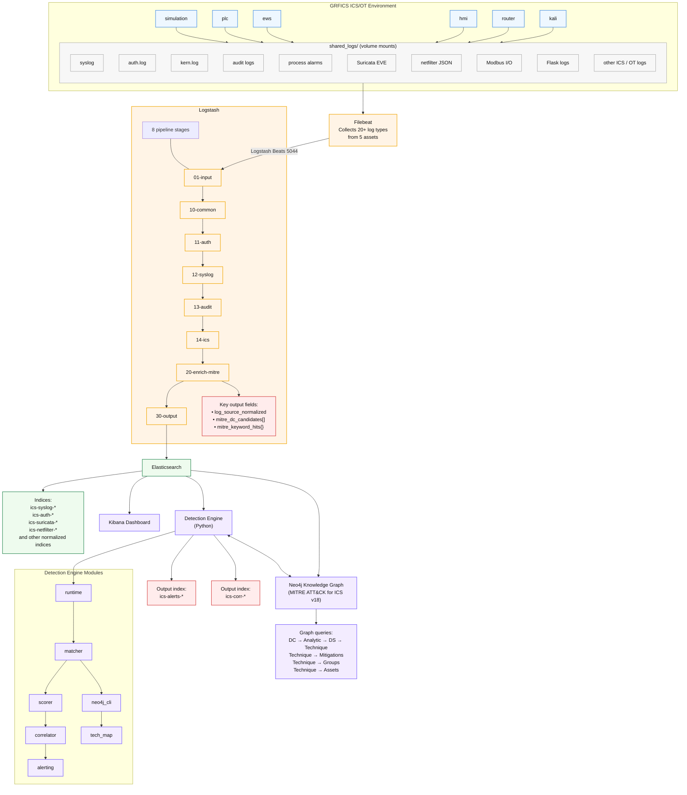

# ICS Detection and Correlation Engine — Design Document

## 1. Architecture Overview



### Data Flow

1. **Collection**: Filebeat reads 20+ log types from 6 GRFICS containers
2. **Parsing**: Logstash normalises fields, sets `log_source_normalized`
3. **Enrichment**: Logstash maps `log_source_normalized` → `mitre_dc_candidates[]`
   using `log_source_to_dc.yml`, then tags `mitre_keyword_hits{}` via Ruby filter
4. **Storage**: Events indexed in Elasticsearch under `ics-*` patterns
5. **Detection**: Engine polls ES, normalises events, scores against DC profiles
6. **Technique Mapping**: Neo4j graph traversal identifies probable techniques
7. **Correlation**: Temporal grouping with chain-step boosting
8. **Alerting**: Explainable alerts stored in `ics-alerts-*`

---

## 2. Scoring Model

### 2.1 Composite Similarity Formula

```
S(event, dc) = w_ls · S_ls + w_kw · S_kw + w_fld · S_fld + w_cat · S_cat + w_ch · S_ch
```

| Signal | Weight | Description | Range |
|--------|--------|-------------|-------|
| `S_ls` (log_source_match) | 0.40 | Binary match from Logstash enrichment or exact name | [0, 1] |
| `S_kw` (keyword_match) | 0.20 | `\|K_hit\| / \|K_profile\|` with optional IDF adjustment | [0, 1] |
| `S_fld` (field_match) | 0.10 | Jaccard similarity of event fields vs. DC profile/ICS fields | [0, 1] |
| `S_cat` (category_match) | 0.20 | Jaccard similarity of inferred categories vs. DC categories | [0, 1] |
| `S_ch` (channel_match) | 0.10 | Fuzzy token-ratio match against DC log-source channels | [0, 1] |

### 2.2 Signal Details

**Log Source Match (S_ls)**
- Primary: If `dc.id ∈ event.mitre_dc_candidates` → 1.0 (Logstash pre-computed)
- Fallback: Exact string match on `log_source_normalized` against DC log-source names
- Prefix match: If the prefix before `:` matches → 0.7

**Keyword Match (S_kw)**
- Uses Aho-Corasick automaton for O(n+m) multi-pattern matching (via `pyahocorasick`)
- Falls back to sequential search if library is unavailable
- Optional IDF weighting: `S_kw × log(N/df(dc)) / log(N)` for rare DCs

**Field Match (S_fld)**
- ICS-specific field map (`ICS_FIELD_MAP`) provides tailored field lists for each DC
  (e.g., DC0109 checks for `modbus.function_code`, `ics.alarm_type`, `process_alarm`)
- Falls back to DC profile's generic field list
- Uses Jaccard similarity: `|F_event ∩ F_dc| / |F_event ∪ F_dc|`

**Category Match (S_cat)**
- Categories inferred from log type, source name, and message content
- Covers 15+ category types including `operational_technology`, `process_control`,
  `deep_packet_inspection`, `safety`, `availability`
- Jaccard similarity against DC profile categories

**Channel Match (S_ch)**
- Tokenises DC log-source channel descriptions
- Removes stop words; computes token overlap ratio
- Thresholds: ≥0.8 → 1.0, ≥0.6 → 0.7, ≥0.4 → 0.4

### 2.3 Thresholds

| Threshold | Value | Purpose |
|-----------|-------|---------|
| `candidate_threshold` | 0.35 | Minimum score to consider a DC match |
| `alert_threshold` | 0.45 | Minimum score to emit an alert |
| `high_confidence_threshold` | 0.70 | Score for "high" confidence tier |
| `unknown_asset_penalty` | 0.05 | Deduction when asset identity is unknown |

---

## 3. Knowledge Graph Integration

### 3.1 Neo4j Schema (v18)

The MITRE ATT&CK for ICS v18 knowledge graph contains:
- **410 nodes** across 10 labels: Technique (83), Tactic (12), Software (23),
  Group (14), Campaign (7), Asset (18), Mitigation (52), DataComponent (36),
  Analytic (82), DetectionStrategy (83)
- **~1500 relationships** of 7 types: USES, MITIGATES, DETECTS, TARGETS,
  ATTRIBUTED_TO, CONTAINS, ASSOCIATED_WITH

### 3.2 DC → Technique Traversal

There is no direct edge from DataComponent to Technique. The path is:

```
DataComponent ←[USES]← Analytic ←[CONTAINS]← DetectionStrategy →[DETECTS]→ Technique
```

The engine pre-loads all traversals at startup and caches them.

### 3.3 Technique Probability Model

For each technique `t` reachable from a DataComponent `dc`:

```
raw(t) = path_weight(dc→t) × (1 + α_group × norm_group(t))
                             × (1 + α_asset × asset_relevance(t, event))

P(t | dc, event) = raw(t) / Σ_t' raw(t')
```

Where:
- `path_weight`: Number of distinct Analytic nodes linking dc to t
- `norm_group`: `group_count(t) / max_group_count` across all candidates
- `asset_relevance`: 1.0 if technique targets a MITRE Asset matching
  the GRFICS asset role (e.g., PLC → "Programmable Logic Controller")
- `α_group = 0.3`, `α_asset = 0.5` (configurable)

### 3.4 Fallback Mode

When Neo4j is unavailable, the engine uses a hardcoded DC → Technique
fallback map derived from the Caldera attack chains. This ensures the
engine can always produce technique attributions.

---

## 4. Correlation Model

### 4.1 Temporal Grouping

Events are grouped by:
- Same asset ID (with cross-asset exceptions for network DCs)
- Within a configurable time window (default: 300 seconds)
- Preference for groups with matching DC or known chain progressions

### 4.2 Chain-Step Boosting

60+ static chain rules encode expected ICS attack progressions:

| Pattern | Example |
|---------|---------|
| Recon → Content | DC0078 (Flow) → DC0085 (Content) |
| Credential → Execution | DC0067 (Logon) → DC0038 (App Log) |
| Modbus → Alarm | DC0085 (Content) → DC0109 (Process Alarm) |
| Alarm → Device | DC0109 (Process Alarm) → DC0108 (Device Alarm) |
| Command → Impact | DC0064 (Command) → DC0109 (Process Alarm) |

When a new match extends a known chain, a `chain_step_boost` (0.12) is added.

### 4.3 Cross-Asset Correlation

Network-related DCs (DC0078, DC0082, DC0085) are eligible for cross-asset
grouping, allowing correlation of traffic from the router with events on the PLC.

### 4.4 Repeat Escalation

If the same DC appears ≥3 times in a group, a repeat boost is applied
to escalate confidence.

---

## 5. Alert Structure

Each alert includes:

```json
{
  "detection_id": "uuid",
  "timestamp": "ISO8601",
  "datacomponent": "Process/Event Alarm",
  "datacomponent_id": "DC0109",
  "asset_id": "plc",
  "asset_name": "PLC Controller",
  "asset_ip": "192.168.95.2",
  "zone": "ics-net",
  "is_ics_asset": true,
  "similarity_score": 0.72,
  "confidence_tier": "high",
  "signal_scores": {
    "log_source_match": 1.0,
    "keyword_match": 0.375,
    "field_match": 0.286,
    "category_match": 0.5,
    "channel_match": 0.0
  },
  "matched_keywords": ["modbus exception", "interlock"],
  "matched_categories": ["operational_technology", "safety"],
  "matched_log_source": "logstash_enrichment:ics:plc_app->DC0109",
  "technique": {
    "technique_id": "T0831",
    "technique_name": "Manipulation of Control",
    "probability": 0.42,
    "tactics": ["Impair Process Control"],
    "mitigations": [{"id": "M0953", "name": "..."}],
    "groups": ["XENOTIME"],
    "graph_path": "DataComponent(DC0109) <-[USES]- Analytic(AN1234) ...",
    "reasoning": "Technique T0831 is reachable via 3 analytics..."
  },
  "correlation_group_id": "uuid",
  "chain_ids": ["DC0085", "DC0109"],
  "chain_depth": 2,
  "technique_sequence": ["T0861", "T0831"]
}
```

---

## 6. Module Summary

| Module | File | Purpose |
|--------|------|---------|
| **Runtime** | `engine/runtime.py` | Main execution loop (stream/oneshot/backtest) |
| **Config** | `engine/config.py` | YAML config loader with Neo4j support |
| **Models** | `engine/models.py` | All data structures (events, matches, alerts) |
| **Feature Extractor** | `engine/feature_extractor.py` | ES hit → NormalizedEvent |
| **DC Loader** | `engine/dc_loader.py` | Load DC JSON profiles and assets |
| **Scorer** | `engine/scorer.py` | Scientific multi-signal scoring engine |
| **Matcher** | `engine/matcher.py` | Matches events against DC profiles |
| **Correlation** | `engine/correlation.py` | Temporal grouping and chain boosting |
| **Neo4j Client** | `engine/neo4j_client.py` | Knowledge graph connection and caching |
| **Technique Mapper** | `engine/technique_mapper.py` | DC → Technique probability model |
| **Alerting** | `engine/alerting.py` | Alert building with full explainability |
| **ES Client** | `engine/es_client.py` | Elasticsearch connectivity |
| **Templates** | `engine/templates.py` | ES index templates for alerts |

---

## 7. DataComponent Coverage

### ICS-Specific Log Sources and Mapped DCs

| Log Source | Container | `log_source_normalized` | Primary DCs |
|-----------|-----------|------------------------|-------------|
| Suricata IDS | router | `NSM:Flow` | DC0078, DC0082, DC0085 |
| ulogd/netfilter | router | `ics:netfilter` | DC0078, DC0082 |
| Process alarms | simulation | `ics:process_alarm` | DC0109, DC0108 |
| Modbus I/O | simulation | `ics:modbus_io` | DC0109, DC0078, DC0085, DC0107 |
| OpenPLC app | plc | `ics:plc_app` | DC0109, DC0038, DC0108 |
| ScadaLTS/Tomcat | hmi | `hmi:catalina` | DC0038, DC0109 |
| Flask firewall UI | router | `ics:fw_app` | DC0038, DC0061 |
| TE simulation | simulation | `ics:sim_process` | DC0107, DC0109, DC0038 |
| Simulation errors | simulation | `ics:sim_error` | DC0108, DC0109 |
| Auth logs (all) | all | `linux:auth` | DC0002, DC0067 |
| Syslog (all) | all | `linux:syslog` | DC0032, DC0033, DC0038, ... |
| Kernel logs | all | `linux:kern` | DC0004, DC0016, DC0042 |
| Daemon logs | plc, hmi | `linux:daemon` | DC0033, DC0060, DC0041 |
| Process acct | ews | `linux:pacct` | DC0107, DC0032 |
| Docker stdout | all | `docker:runtime` | DC0032, DC0033, DC0038, DC0064 |

### Caldera Attack Chain → DC Mapping

| Chain | Technique | Expected DC |
|-------|-----------|-------------|
| 1: Pressure Manipulation | T0846, T0888, T0861, T0801, T0831 | DC0078, DC0085, DC0107, DC0109 |
| 2: PLC Logic Replacement | T0812, T0845, T0889 | DC0067, DC0038, DC0061, DC0109 |
| 3: HMI Compromise | T0812, T0846, T0831 | DC0067, DC0038, DC0109 |
| 4: Safety System Defeat | T0861, T0821 | DC0085, DC0109, DC0108 |
| 5: EWS Pivot | T0840, T0893, T0867, T0877, T0835 | DC0078, DC0032, DC0085, DC0109 |
| 6: Rogue Modbus Master | T0868, T0836, T0806, T0814 | DC0085, DC0078, DC0109, DC0108 |
| 7: HMI View/Alarms | T0871, T0802, T0838, T0832 | DC0038, DC0109, DC0107 |
| 8: Network Sabotage | T0812, T0881, T0872, T0803, T0804 | DC0067, DC0078, DC0033, DC0085 |
| 9: PLC Mode/Destruction | T0868, T0858, T0845, T0809, T0849 | DC0038, DC0109, DC0061, DC0108 |
| 10: Full Campaign | Multiple | All of the above |

---

## 8. Configuration Reference

### `config/detection.yml`

```yaml
scoring_weights:
  log_source_match: 0.40   # Highest: Logstash enrichment is authoritative
  keyword_match: 0.20      # DC keyword overlap
  field_match: 0.10        # Jaccard on event fields
  category_match: 0.20     # Jaccard on inferred categories
  channel_match: 0.10      # Channel fuzzy match

neo4j:
  enabled: false            # Set true when graph is available
  uri: "bolt://localhost:7687"
  username: "neo4j"
  password: "secret"

technique_mapper:
  alpha_group: 0.3          # Group usage weight
  alpha_asset: 0.5          # Asset relevance weight
  max_candidates: 5         # Top-K techniques per alert
```

---

## 9. Assumptions and Limitations

1. **Neo4j availability**: The engine degrades gracefully to a hardcoded
   fallback map when Neo4j is unreachable. Full graph features require
   a running Neo4j instance with the v18 schema loaded.

2. **Logstash enrichment dependency**: The `mitre_dc_candidates` field
   from Logstash is the primary signal for log-source matching. Without
   it, the engine falls back to string-based matching against DC profile
   names, which is less accurate for ICS-specific logs.

3. **Docker networking blind spot**: Intra-ICS Modbus traffic between
   simulation and PLC is not captured by network monitoring. Detection
   relies on application-level logs from each container.

4. **DC profile Windows bias**: The DataComponent JSON files contain
   extensive Windows/macOS log sources but limited Linux/ICS entries.
   The `ICS_FIELD_MAP` in the matcher compensates for this by providing
   ICS-specific field lists per DC.

5. **Chain rules are static**: The correlation chain rules are manually
   curated. A future enhancement could derive them from the knowledge
   graph's technique-to-tactic sequences.

---

## 10. Recommended Next Steps

1. **Deploy Neo4j**: Run the v18 graph builder (`mitre_ics_matrix_v18_to_kg.py`
   + `add_missing_relationships.py`) and enable the `neo4j` section in config.

2. **Tune thresholds**: After collecting real attack logs from Caldera chains,
   adjust `candidate_threshold` and `alert_threshold` based on precision/recall.

3. **Add Suricata Modbus rules**: Create custom Suricata rules for GRFICS-specific
   Modbus function codes to generate richer `ics:modbus_io` events.

4. **Implement Kibana dashboards**: Build visualisations for alert trends,
   technique distribution, and correlation chain analysis.

5. **Dynamic chain rules**: Query the knowledge graph to discover technique
   sequences used by known threat groups and derive chain rules automatically.

---

## 11. References

1. MITRE ATT&CK for ICS v18: https://attack.mitre.org/versions/v18/matrices/ics/
2. Jaccard Similarity: Jaccard, P. (1912). "The distribution of the flora in the alpine zone."
3. Aho-Corasick Algorithm: Aho, A. V., & Corasick, M. J. (1975). "Efficient string matching."
4. TF-IDF: Salton, G. & Buckley, C. (1988). "Term-weighting approaches in automatic text retrieval."
5. GRFICS: Formby, D. et al. (2018). "GRFICS: A Graphical Realism Framework for ICS."
6. Caldera for OT: MITRE (2023). "Caldera for OT."
