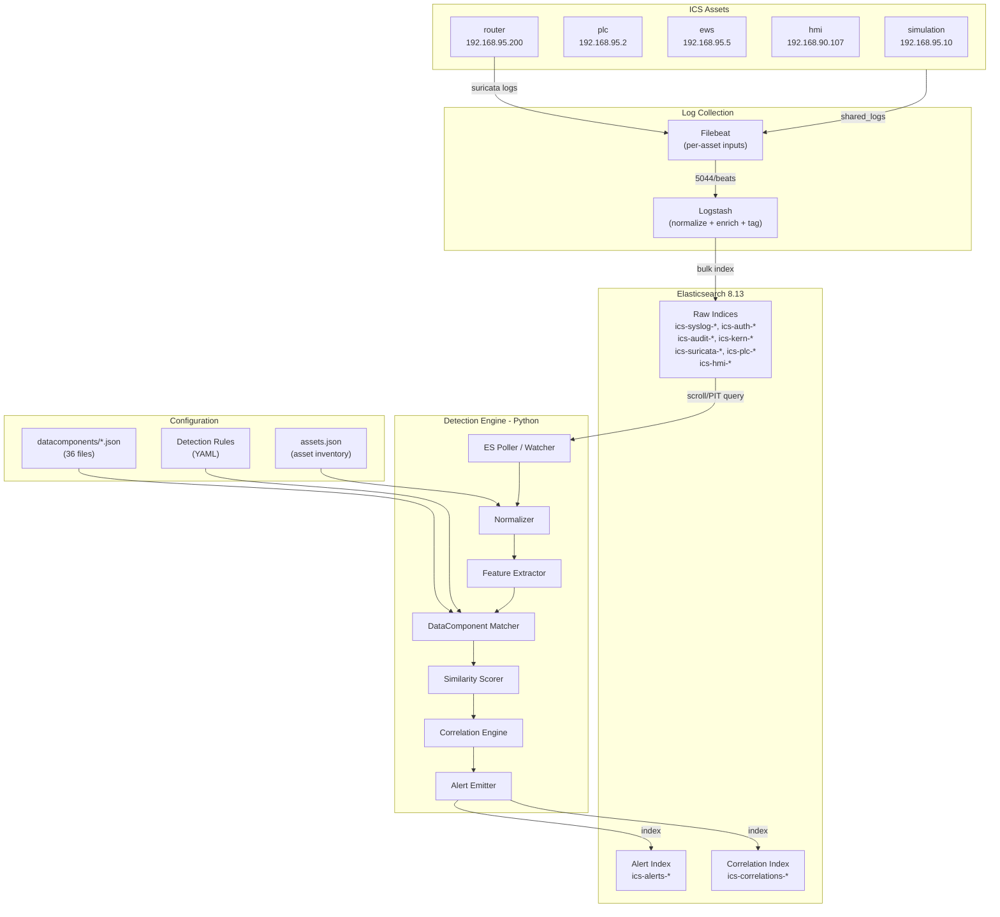
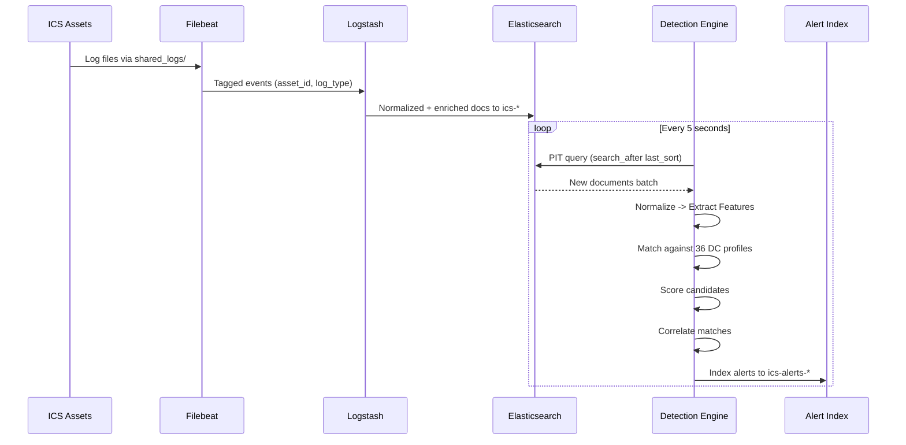

# ICS DataComponent Detection and Correlation Engine - Complete Design

## 1. Full Architecture

### 1.1 System Overview




### 1.2 Component Responsibilities

- **Ingestion (Filebeat)**: Reads shared log files from each ICS asset's mounted directories. Tags each log with `asset_id`, `asset_name`, `log_type` at collection time.
- **Normalization (Logstash)**: Parses raw logs into structured fields using grok/dissect patterns. Enriches with MITRE DataComponent tags using a translate filter dictionary derived from the `datacomponents/*.json` files. Routes to typed ES indices.
- **Feature Extraction (Python Engine)**: Extracts signals from normalized log events: field names present, keyword matches, log source type, platform hints, process names, network tuples.
- **Matching (Python Engine)**: Compares extracted features against all 36 DataComponent profiles. Uses a multi-signal scoring approach (log_source match, keyword match, field match, category match).
- **Scoring (Python Engine)**: Computes a 0..1 similarity score using a weighted formula. Applies thresholds to separate true positives from noise.
- **Correlation (Python Engine)**: Groups related matches within temporal windows, by asset, and by attack chain logic. Produces correlation groups.
- **Alert Generation**: Emits the structured alert JSON for each detection, indexes to `ics-alerts-`*.
- **Storage / Feedback Loop**: Alerts are indexed back into ES. Analysts can mark false positives, which feeds back into threshold calibration.

### 1.3 Key Design Decisions

- **Python-based detection engine** rather than pure Logstash/Watcher, because: the matching logic requires multi-field fuzzy comparison against 36 DC profiles with weighted scoring, temporal correlation across events, and asset-aware grouping -- none of which Logstash or ES Watcher can express natively.
- **Near-real-time polling** (every 5-10 seconds via ES PIT + `search_after`) rather than true streaming, because: ES 8.13 does not have native streaming; polling with PIT gives ordered, reliable, resumable reads.
- **Hybrid rule + heuristic approach** (no ML initially) to keep the system explainable and auditable.

---

## 2. Filebeat and Logstash Configuration

### 2.1 Filebeat Configuration (`filebeat/filebeat.yml`)

```yaml
filebeat.inputs:

  # ── Syslog inputs (simulation, plc, ews, hmi, router) ──
  - type: log
    id: syslog-simulation
    paths: ["/shared_logs/simulation/syslog"]
    fields: { asset_id: "simulation", asset_name: "ICS Simulation", log_type: "syslog", asset_ip: "192.168.95.10", zone: "ics-net" }
    fields_under_root: true

  - type: log
    id: auth-simulation
    paths: ["/shared_logs/simulation/auth.log"]
    fields: { asset_id: "simulation", asset_name: "ICS Simulation", log_type: "auth", asset_ip: "192.168.95.10", zone: "ics-net" }
    fields_under_root: true

  - type: log
    id: kern-simulation
    paths: ["/shared_logs/simulation/kern.log"]
    fields: { asset_id: "simulation", asset_name: "ICS Simulation", log_type: "kern", asset_ip: "192.168.95.10", zone: "ics-net" }
    fields_under_root: true

  - type: log
    id: alarm-simulation
    paths: ["/shared_logs/simulation/process_alarms/*"]
    fields: { asset_id: "simulation", asset_name: "ICS Simulation", log_type: "process_alarm", asset_ip: "192.168.95.10", zone: "ics-net" }
    fields_under_root: true

  # ── PLC ──
  - type: log
    id: auth-plc
    paths: ["/shared_logs/plc/auth.log"]
    fields: { asset_id: "plc", asset_name: "PLC Controller", log_type: "auth", asset_ip: "192.168.95.2", zone: "ics-net" }
    fields_under_root: true

  - type: log
    id: syslog-plc
    paths: ["/shared_logs/plc/syslog"]
    fields: { asset_id: "plc", asset_name: "PLC Controller", log_type: "syslog", asset_ip: "192.168.95.2", zone: "ics-net" }
    fields_under_root: true

  - type: log
    id: daemon-plc
    paths: ["/shared_logs/plc/daemon.log"]
    fields: { asset_id: "plc", asset_name: "PLC Controller", log_type: "daemon", asset_ip: "192.168.95.2", zone: "ics-net" }
    fields_under_root: true

  - type: log
    id: audit-plc
    paths: ["/shared_logs/plc/audit/*"]
    fields: { asset_id: "plc", asset_name: "PLC Controller", log_type: "audit", asset_ip: "192.168.95.2", zone: "ics-net" }
    fields_under_root: true

  - type: log
    id: plcapp-plc
    paths: ["/shared_logs/plc/plc_app/*"]
    fields: { asset_id: "plc", asset_name: "PLC Controller", log_type: "plc_app", asset_ip: "192.168.95.2", zone: "ics-net" }
    fields_under_root: true

  - type: log
    id: kern-plc
    paths: ["/shared_logs/plc/kern.log"]
    fields: { asset_id: "plc", asset_name: "PLC Controller", log_type: "kern", asset_ip: "192.168.95.2", zone: "ics-net" }
    fields_under_root: true

  # ── EWS (Engineering Workstation) ──
  - type: log
    id: auth-ews
    paths: ["/shared_logs/ews/auth.log"]
    fields: { asset_id: "ews", asset_name: "Engineering Workstation", log_type: "auth", asset_ip: "192.168.95.5", zone: "ics-net" }
    fields_under_root: true

  - type: log
    id: syslog-ews
    paths: ["/shared_logs/ews/syslog"]
    fields: { asset_id: "ews", asset_name: "Engineering Workstation", log_type: "syslog", asset_ip: "192.168.95.5", zone: "ics-net" }
    fields_under_root: true

  - type: log
    id: daemon-ews
    paths: ["/shared_logs/ews/daemon.log"]
    fields: { asset_id: "ews", asset_name: "Engineering Workstation", log_type: "daemon", asset_ip: "192.168.95.5", zone: "ics-net" }
    fields_under_root: true

  - type: log
    id: audit-ews
    paths: ["/shared_logs/ews/audit/*"]
    fields: { asset_id: "ews", asset_name: "Engineering Workstation", log_type: "audit", asset_ip: "192.168.95.5", zone: "ics-net" }
    fields_under_root: true

  - type: log
    id: kern-ews
    paths: ["/shared_logs/ews/kern.log"]
    fields: { asset_id: "ews", asset_name: "Engineering Workstation", log_type: "kern", asset_ip: "192.168.95.5", zone: "ics-net" }
    fields_under_root: true

  - type: log
    id: cron-ews
    paths: ["/shared_logs/ews/cron.log"]
    fields: { asset_id: "ews", asset_name: "Engineering Workstation", log_type: "cron", asset_ip: "192.168.95.5", zone: "ics-net" }
    fields_under_root: true

  - type: log
    id: pacct-ews
    paths: ["/shared_logs/ews/pacct"]
    fields: { asset_id: "ews", asset_name: "Engineering Workstation", log_type: "pacct", asset_ip: "192.168.95.5", zone: "ics-net" }
    fields_under_root: true

  # ── HMI ──
  - type: log
    id: catalina-hmi
    paths: ["/shared_logs/hmi/catalina/*.log"]
    fields: { asset_id: "hmi", asset_name: "HMI ScadaLTS", log_type: "hmi_catalina", asset_ip: "192.168.90.107", zone: "dmz-net" }
    fields_under_root: true

  - type: log
    id: auth-hmi
    paths: ["/shared_logs/hmi/auth.log"]
    fields: { asset_id: "hmi", asset_name: "HMI ScadaLTS", log_type: "auth", asset_ip: "192.168.90.107", zone: "dmz-net" }
    fields_under_root: true

  - type: log
    id: syslog-hmi
    paths: ["/shared_logs/hmi/syslog"]
    fields: { asset_id: "hmi", asset_name: "HMI ScadaLTS", log_type: "syslog", asset_ip: "192.168.90.107", zone: "dmz-net" }
    fields_under_root: true

  - type: log
    id: audit-hmi
    paths: ["/shared_logs/hmi/audit/*"]
    fields: { asset_id: "hmi", asset_name: "HMI ScadaLTS", log_type: "audit", asset_ip: "192.168.90.107", zone: "dmz-net" }
    fields_under_root: true

  # ── Router (Suricata) ──
  - type: log
    id: suricata-eve
    paths: ["/shared_logs/router/eve.json"]
    json.keys_under_root: true
    json.add_error_key: true
    fields: { asset_id: "router", asset_name: "ICS Router/Firewall", log_type: "suricata", asset_ip: "192.168.95.200", zone: "perimeter" }
    fields_under_root: true

  - type: log
    id: syslog-router
    paths: ["/shared_logs/router/syslog"]
    fields: { asset_id: "router", asset_name: "ICS Router/Firewall", log_type: "syslog", asset_ip: "192.168.95.200", zone: "perimeter" }
    fields_under_root: true

output.logstash:
  hosts: ["logstash:5044"]

processors:
  - add_host_metadata: ~
  - timestamp:
      field: "@timestamp"
      layouts: ["UNIX", "UNIX_MS", "2006-01-02T15:04:05Z07:00"]
      test: ["2024-01-01T00:00:00Z"]
```

### 2.2 Logstash Pipeline Configuration

**File: `logstash/pipeline/01-input.conf`**

```ruby
input {
  beats {
    port => 5044
    type => "beats"
  }
  udp {
    port => 5000
    type => "syslog_udp"
  }
}
```

**File: `logstash/pipeline/10-parse-syslog.conf`**

```ruby
filter {
  if [log_type] in ["syslog", "daemon", "kern"] {
    grok {
      match => { "message" => [
        "%{SYSLOGTIMESTAMP:syslog_timestamp} %{SYSLOGHOST:syslog_hostname} %{DATA:syslog_program}(?:\[%{POSINT:syslog_pid}\])?: %{GREEDYDATA:syslog_message}",
        "%{GREEDYDATA:syslog_message}"
      ]}
      tag_on_failure => ["_grokparsefailure_syslog"]
    }
    date {
      match => ["syslog_timestamp", "MMM  d HH:mm:ss", "MMM dd HH:mm:ss", "ISO8601"]
      target => "@timestamp"
    }
    mutate {
      rename => { "syslog_message" => "log_message" }
      add_field => { "log_source_normalized" => "linux:syslog" }
    }
  }
}
```

**File: `logstash/pipeline/11-parse-auth.conf`**

```ruby
filter {
  if [log_type] == "auth" {
    grok {
      match => { "message" => [
        "%{SYSLOGTIMESTAMP:syslog_timestamp} %{SYSLOGHOST:syslog_hostname} %{DATA:auth_program}(?:\[%{POSINT:auth_pid}\])?: %{GREEDYDATA:auth_message}"
      ]}
    }
    date {
      match => ["syslog_timestamp", "MMM  d HH:mm:ss", "MMM dd HH:mm:ss"]
      target => "@timestamp"
    }

    # Extract SSH login specifics
    grok {
      match => { "auth_message" => [
        "Accepted %{WORD:auth_method} for %{USERNAME:auth_user} from %{IP:src_ip} port %{INT:src_port} ssh2",
        "Failed %{WORD:auth_method} for %{USERNAME:auth_user} from %{IP:src_ip} port %{INT:src_port}",
        "pam_unix\(%{DATA:pam_service}\): session opened for user %{USERNAME:auth_user}",
        "New session %{INT:session_id} of user %{USERNAME:auth_user}"
      ]}
      tag_on_failure => ["_grokparsefailure_auth_detail"]
    }

    mutate {
      rename => { "auth_message" => "log_message" }
      add_field => { "log_source_normalized" => "linux:syslog" }
    }
  }
}
```

**File: `logstash/pipeline/12-parse-audit.conf`**

```ruby
filter {
  if [log_type] == "audit" {
    grok {
      match => { "message" => [
        "type=%{WORD:audit_type} msg=audit\(%{NUMBER:audit_epoch}:%{NUMBER:audit_serial}\): %{GREEDYDATA:audit_message}"
      ]}
    }
    date {
      match => ["audit_epoch", "UNIX"]
      target => "@timestamp"
    }

    # Extract syscall details
    kv {
      source => "audit_message"
      field_split => " "
      value_split => "="
      target => "audit_fields"
    }

    mutate {
      rename => { "audit_message" => "log_message" }
      add_field => {
        "log_source_normalized" => "auditd:%{audit_type}"
      }
    }
  }
}
```

**File: `logstash/pipeline/13-parse-suricata.conf`**

```ruby
filter {
  if [log_type] == "suricata" {
    if [event_type] == "alert" {
      mutate { add_field => { "log_source_normalized" => "NSM:Flow" } }
    } else if [event_type] == "flow" {
      mutate { add_field => { "log_source_normalized" => "NSM:Flow" } }
    } else if [event_type] == "dns" {
      mutate { add_field => { "log_source_normalized" => "NSM:Flow" } }
    } else if [event_type] == "http" {
      mutate { add_field => { "log_source_normalized" => "NSM:Flow" } }
    } else if [event_type] == "tls" {
      mutate { add_field => { "log_source_normalized" => "NSM:Flow" } }
    } else {
      mutate { add_field => { "log_source_normalized" => "NSM:Connections" } }
    }
    mutate {
      rename => { "message" => "log_message" }
    }
  }
}
```

**File: `logstash/pipeline/14-parse-ics.conf`**

```ruby
filter {
  if [log_type] in ["plc_app", "process_alarm"] {
    mutate {
      add_field => { "log_source_normalized" => "ics:process_alarm" }
    }
    if [log_type] == "process_alarm" {
      grok {
        match => { "message" => [
          "%{GREEDYDATA:alarm_message}"
        ]}
      }
      mutate { rename => { "alarm_message" => "log_message" } }
    }
  }

  if [log_type] == "hmi_catalina" {
    mutate {
      add_field => { "log_source_normalized" => "hmi:catalina" }
    }
  }

  if [log_type] == "cron" {
    mutate {
      add_field => { "log_source_normalized" => "linux:cron" }
    }
  }

  if [log_type] == "pacct" {
    mutate {
      add_field => { "log_source_normalized" => "linux:pacct" }
    }
  }
}
```

**File: `logstash/pipeline/20-enrich-mitre.conf`**

```ruby
filter {
  # MITRE DataComponent candidate tagging based on log_source_normalized
  # This uses a translate filter with dictionary derived from datacomponents/*.json
  translate {
    source => "log_source_normalized"
    target => "mitre_dc_candidates"
    dictionary_path => "/usr/share/logstash/mitre_mapping/log_source_to_dc.yml"
    fallback => "unknown"
  }

  # Keyword-based enrichment: scan log_message for DC keywords
  # Implemented via ruby filter for flexibility
  ruby {
    path => "/usr/share/logstash/mitre_mapping/keyword_tagger.rb"
  }
}
```

**File: `logstash/pipeline/30-output.conf`**

```ruby
output {
  if [log_type] == "suricata" {
    elasticsearch {
      hosts => ["elasticsearch:9200"]
      index => "ics-suricata-%{+YYYY.MM.dd}"
    }
  } else if [log_type] == "auth" {
    elasticsearch {
      hosts => ["elasticsearch:9200"]
      index => "ics-auth-%{+YYYY.MM.dd}"
    }
  } else if [log_type] == "audit" {
    elasticsearch {
      hosts => ["elasticsearch:9200"]
      index => "ics-audit-%{+YYYY.MM.dd}"
    }
  } else if [log_type] in ["plc_app", "process_alarm"] {
    elasticsearch {
      hosts => ["elasticsearch:9200"]
      index => "ics-process-%{+YYYY.MM.dd}"
    }
  } else if [log_type] == "hmi_catalina" {
    elasticsearch {
      hosts => ["elasticsearch:9200"]
      index => "ics-hmi-%{+YYYY.MM.dd}"
    }
  } else {
    elasticsearch {
      hosts => ["elasticsearch:9200"]
      index => "ics-syslog-%{+YYYY.MM.dd}"
    }
  }
}
```

### 2.3 Logstash MITRE Mapping Dictionary

**File: `logstash/mitre_mapping/log_source_to_dc.yml`** -- derived programmatically from `datacomponents/*.json` by scanning each DC's `log_sources[].Name` field and mapping names containing `linux:syslog` -> `["DC0001","DC0016","DC0032","DC0033","DC0034","DC0067","DC0082","DC0085"]`, etc. Example:

```yaml
"linux:syslog": "DC0001,DC0016,DC0032,DC0033,DC0034,DC0067,DC0082,DC0085"
"linux:cron": "DC0001"
"auditd:SYSCALL": "DC0004,DC0016,DC0021,DC0032,DC0033,DC0034,DC0039,DC0040,DC0055,DC0059,DC0061,DC0067,DC0078,DC0082,DC0085"
"auditd:EXECVE": "DC0032"
"auditd:FILE": "DC0039,DC0055,DC0061"
"auditd:PATH": "DC0039,DC0055,DC0059,DC0061"
"NSM:Flow": "DC0078,DC0082,DC0085"
"NSM:Connections": "DC0067,DC0078,DC0082,DC0085,DC0088"
"ics:process_alarm": "DC0109"
"hmi:catalina": "DC0109"
"linux:pacct": "DC0107"
```

---

## 3. Detailed Matching Strategy

### 3.1 Overview

Each incoming normalized log event is matched against the 36 DataComponent profiles using a **multi-signal, weighted scoring** approach. The match is NOT binary -- it produces a continuous similarity score from 0.0 to 1.0.

### 3.2 Signal Types and Weights


| Signal             | Weight | Description                                                                                                                                              |
| ------------------ | ------ | -------------------------------------------------------------------------------------------------------------------------------------------------------- |
| `log_source_match` | 0.35   | Does `log_source_normalized` match any entry in the DC's `log_sources[].Name`? Exact match = full weight. Prefix match (e.g., `auditd:`*) = 0.7x weight. |
| `keyword_match`    | 0.25   | How many of the DC's `searchable_indexes.keywords` appear in the log message or fields? Score = matched_count / total_keywords, capped at 1.0.           |
| `field_match`      | 0.20   | How many of the DC's `searchable_indexes.fields` are present in the normalized event? Score = present_count / total_fields.                              |
| `category_match`   | 0.10   | Does the log_type or inferred category align with any of the DC's `searchable_indexes.categories`? Binary 0 or 1.                                        |
| `channel_match`    | 0.10   | Does the log content match the specific `log_sources[].Channel` description? Uses substring/regex matching against the Channel value.                    |


### 3.3 Matching Pseudocode

```python
def match_event_to_dc(event: NormalizedEvent, dc: DataComponentProfile) -> CandidateMatch:
    scores = {}
    evidence = {}

    # 1. Log Source Match
    source_score = 0.0
    for ls in dc.log_sources:
        if event.log_source_normalized == ls.Name:
            source_score = 1.0
            evidence["log_source"] = ls.Name
            break
        elif event.log_source_normalized.startswith(ls.Name.split(":")[0]):
            source_score = max(source_score, 0.7)
            evidence["log_source_partial"] = ls.Name
    scores["log_source_match"] = source_score

    # 2. Keyword Match
    message_lower = event.log_message.lower()
    all_fields_text = " ".join(str(v) for v in event.fields.values()).lower()
    combined_text = message_lower + " " + all_fields_text
    matched_keywords = [kw for kw in dc.keywords if kw.lower() in combined_text]
    scores["keyword_match"] = min(len(matched_keywords) / max(len(dc.keywords), 1), 1.0)
    evidence["matched_keywords"] = matched_keywords

    # 3. Field Match
    dc_fields_lower = {f.lower() for f in dc.fields}
    event_fields_lower = {f.lower() for f in event.fields.keys()}
    field_overlap = dc_fields_lower & event_fields_lower
    scores["field_match"] = len(field_overlap) / max(len(dc_fields_lower), 1)
    evidence["matched_fields"] = list(field_overlap)

    # 4. Category Match
    event_categories = infer_categories(event)  # from log_type, program, etc.
    cat_overlap = set(event_categories) & set(dc.categories)
    scores["category_match"] = 1.0 if cat_overlap else 0.0
    evidence["matched_categories"] = list(cat_overlap)

    # 5. Channel Match (substring/regex against specific log_source Channel values)
    channel_score = 0.0
    for ls in dc.log_sources:
        if ls.Channel and ls.Channel != "None":
            if fuzzy_channel_match(combined_text, ls.Channel):
                channel_score = 1.0
                evidence["channel_match"] = ls.Channel
                break
    scores["channel_match"] = channel_score

    # Weighted sum
    weights = {"log_source_match": 0.35, "keyword_match": 0.25,
               "field_match": 0.20, "category_match": 0.10, "channel_match": 0.10}
    similarity = sum(scores[k] * weights[k] for k in weights)

    return CandidateMatch(
        datacomponent_id=dc.id,
        datacomponent_name=dc.name,
        similarity_score=round(similarity, 4),
        signal_scores=scores,
        evidence=evidence,
        event=event
    )
```

### 3.4 Channel Matching Detail

The `Channel` field in each DC's `log_sources` contains descriptions like:

- `"sshd: Accepted password/publickey"` (DC0067)
- `"exit_group"` (DC0033)
- `"kill syscalls targeting logging/security processes"` (DC0033)
- `"conn.log"` (DC0078/DC0082)

The `fuzzy_channel_match` function:

1. Tokenizes the Channel value into significant terms (removing stop words).
2. Checks if at least 60% of significant tokens appear in the event text.
3. Also checks for regex patterns if the Channel contains regex-like syntax.

### 3.5 Reducing False Positives and False Negatives

- **Threshold gating**: Only matches with `similarity_score >= 0.40` are promoted to candidate matches. Scores below 0.40 are discarded.
- **Confidence tiers**: 0.40-0.59 = "low", 0.60-0.79 = "medium", 0.80-1.0 = "high". Only "medium" and "high" generate alerts by default.
- **Platform filtering**: If a DC's `searchable_indexes.platforms` does not include `"linux"`, `"ics"`, `"scada"`, `"ot"`, `"network"`, or `"generic"`, it is still considered but receives a 0.5x penalty on the final score (since this lab is Linux-based).
- **Asset exclusion**: Events from `kali` or `caldera` containers are explicitly excluded from ICS detection (they are attack simulation only).
- **Deduplication**: If the same event matches multiple DCs with score > 0.4, all matches are emitted but flagged as `ambiguous_match: true` in metadata.
- **Suppression window**: After an alert fires for a given (DC, asset) pair, suppress identical alerts for a configurable period (default 60s) unless the score increases.

---

## 4. Correlation Strategy

### 4.1 Correlation Dimensions

Events are correlated across three dimensions:

1. **Temporal**: Events within a sliding window (configurable, default 300 seconds)
2. **Asset**: Events sharing the same `asset_id`
3. **DataComponent chain**: Events matching DCs that commonly co-occur in attack sequences

### 4.2 Correlation Algorithm

```python
class CorrelationEngine:
    def __init__(self, window_seconds=300):
        self.window = window_seconds
        self.active_groups: Dict[str, CorrelationGroup] = {}
        self.chain_rules = load_chain_rules()  # e.g., DC0067 -> DC0032 -> DC0033

    def process_match(self, match: CandidateMatch) -> Optional[CorrelationGroup]:
        group_key = f"{match.event.asset_id}:{match.datacomponent_id}"

        # Check if this match extends an existing group
        for gid, group in self.active_groups.items():
            if self._should_merge(group, match):
                group.add_match(match)
                group.update_score()
                return group

        # Check chain rules: does this match follow a previous DC detection?
        for gid, group in self.active_groups.items():
            if (group.asset_id == match.event.asset_id and
                self._is_chain_successor(group.last_dc_id, match.datacomponent_id) and
                self._within_window(group.last_timestamp, match.event.timestamp)):
                group.add_match(match)
                group.chain_depth += 1
                group.update_score()
                return group

        # Create new group
        new_group = CorrelationGroup(match)
        self.active_groups[new_group.id] = new_group
        return new_group

    def _should_merge(self, group, match):
        return (group.asset_id == match.event.asset_id and
                group.datacomponent_id == match.datacomponent_id and
                self._within_window(group.last_timestamp, match.event.timestamp))

    def _within_window(self, t1, t2):
        return abs((t2 - t1).total_seconds()) <= self.window
```

### 4.3 Chain Rules (Attack Sequences)

Defined based on MITRE ATT&CK for ICS kill chain:

- **Reconnaissance chain**: DC0067 (Logon) -> DC0032 (Process Creation) -> DC0034 (Process Metadata)
- **Persistence chain**: DC0032 (Process Creation) -> DC0001 (Scheduled Job) -> DC0039 (File Creation)
- **Impact chain**: DC0082 (Network Connection) -> DC0032 (Process Creation) -> DC0109 (Process Alarm)
- **Lateral Movement**: DC0067 (Logon) -> DC0082 (Network Connection) -> DC0078 (Network Flow)
- **Defense Evasion**: DC0033 (Process Termination) -> DC0040 (File Deletion) -> DC0061 (File Modification)

### 4.4 Repeated Events

- Events matching the same DC on the same asset are grouped and counted.
- If count > threshold (configurable, default 5 within the window), the group's severity is escalated.
- Repeated identical log messages are deduplicated (same message hash within 10s).

### 4.5 Asset Connection

- Every event carries `asset_id`, `asset_name`, `asset_ip`, and `zone` from Filebeat tagging.
- Cross-asset correlation: if DC0082 (Network Connection) matches on router with `src_ip=192.168.95.5` (ews) and `dst_ip=192.168.95.2` (plc), the correlation links both assets.
- Unknown assets (IPs not in `assets.json`) are tagged `asset_id: "unknown"`, `asset_name: "Unknown Device (<ip>)"`.

---

## 5. Similarity Scoring Model

### 5.1 Score Formula

```
similarity = (0.35 * log_source_score) +
             (0.25 * keyword_score) +
             (0.20 * field_score) +
             (0.10 * category_score) +
             (0.10 * channel_score)
```

All component scores are in [0.0, 1.0]. The weighted sum yields a score in [0.0, 1.0].

### 5.2 Signal Contributions

- **log_source_score (35%)**: The strongest signal. If the log source name exactly matches a DC's `log_sources[].Name`, this alone contributes 0.35 to the final score. This is by design because the `log_sources` field in each DC is described as "MOST IMPORTANT" in the requirements.
- **keyword_score (25%)**: Keywords like `"sshd"`, `"accepted password"`, `"cron"`, `"exit_group"` from the DC's `searchable_indexes.keywords` are checked against the full log text. Fractional: 3 of 10 keywords matched = 0.3 * 0.25 = 0.075 contribution.
- **field_score (20%)**: Structural match. If the normalized event has fields like `ProcessName`, `User`, `SourceNetworkAddress` that overlap with the DC's `searchable_indexes.fields`, this signals structural compatibility.
- **category_score (10%)**: Semantic alignment. Categories like `"authentication"`, `"process_execution"`, `"network_traffic"` are inferred from the event's log_type and matched.
- **channel_score (10%)**: The most specific signal. A channel like `"sshd: Accepted password/publickey"` matching exactly in the log message is strong evidence.

### 5.3 Threshold Calibration

- **Initial thresholds** (tunable via config):
  - `alert_threshold`: 0.50 (below this, no alert emitted)
  - `high_confidence_threshold`: 0.75
  - Correlation boost: +0.05 for each additional correlated event in a group, capped at +0.15
  - Chain boost: +0.10 for each chain step completed
- **Calibration method**: Run against historical logs with known ground truth (from Caldera attack simulations). Adjust thresholds to maximize F1 score. Store per-DC thresholds in config if needed.

### 5.4 Missing or Noisy Fields

- **Missing fields**: If a DC expects 8 fields and the event only has 2, the `field_score` will be low (2/8 = 0.25) but won't zero-out the entire score. The log_source and keyword signals can still carry the match.
- **Noisy fields**: Fields containing generic values (e.g., `User: "root"` appearing in every log) are downweighted by maintaining a field-value frequency table. Values appearing in >80% of logs receive 0.5x credit.
- **Missing log_message**: If the message field is empty, keyword_score and channel_score default to 0.0. Only structural signals (log_source, fields, category) contribute.

---

## 6. Data Model

### 6.1 Normalized Log Event

```python
@dataclass
class NormalizedEvent:
    doc_id: str                    # ES _id
    es_index: str                  # ES index name
    timestamp: datetime            # Parsed timestamp
    asset_id: str                  # "plc", "ews", "simulation", "hmi", "router"
    asset_name: str                # "PLC Controller", etc.
    asset_ip: str                  # "192.168.95.2"
    zone: str                      # "ics-net", "dmz-net", "perimeter"
    log_type: str                  # "auth", "syslog", "audit", "suricata", etc.
    log_source_normalized: str     # "linux:syslog", "auditd:SYSCALL", "NSM:Flow"
    log_message: str               # The raw or parsed message content
    fields: Dict[str, Any]         # All extracted fields
    mitre_dc_candidates: List[str] # Candidate DC IDs from Logstash enrichment
    raw_source: Dict[str, Any]     # Full ES document for evidence
```

### 6.2 DataComponent Profile

```python
@dataclass
class DataComponentProfile:
    id: str                        # "DC0067"
    name: str                      # "Logon Session Creation"
    description: str
    platforms: List[str]           # ["windows", "linux", ...]
    log_source_types: List[str]    # ["event_log", "syslog", ...]
    categories: List[str]          # ["authentication", "user_session"]
    fields: List[str]              # ["EventID", "LogonType", ...]
    keywords: List[str]            # ["4624", "accepted password", ...]
    log_sources: List[LogSource]   # [{Name, Channel}, ...]
    collection_measures: Dict      # Platform-specific guidance
```

### 6.3 Candidate Match

```python
@dataclass
class CandidateMatch:
    match_id: str                  # UUID
    datacomponent_id: str          # "DC0067"
    datacomponent_name: str        # "Logon Session Creation"
    similarity_score: float        # 0.0 to 1.0
    signal_scores: Dict[str, float]  # {log_source_match: 0.8, ...}
    evidence: Dict[str, Any]       # {matched_keywords: [...], ...}
    event: NormalizedEvent
    confidence_tier: str           # "low", "medium", "high"
    is_ambiguous: bool             # True if multiple DCs matched same event
```

### 6.4 Correlation Group

```python
@dataclass
class CorrelationGroup:
    group_id: str                  # UUID
    asset_id: str
    asset_name: str
    primary_dc_id: str             # The DC with highest aggregate score
    matches: List[CandidateMatch]
    chain_depth: int               # How many chain steps completed
    chain_ids: List[str]           # ["DC0067", "DC0032", "DC0033"]
    first_timestamp: datetime
    last_timestamp: datetime
    event_count: int
    aggregate_score: float         # max(individual scores) + correlation bonus
    status: str                    # "open", "closed", "escalated"
```

### 6.5 Final Alert

```python
@dataclass
class DetectionAlert:
    detection_id: str              # UUID
    datacomponent: str             # "Logon Session Creation"
    datacomponent_id: str          # "DC0067"
    asset_id: str                  # "ews"
    asset_name: str                # "Engineering Workstation"
    es_index: str                  # "ics-auth-2024.01.15"
    document_id: str               # ES _id
    timestamp: str                 # ISO 8601
    matched_fields: Dict[str, str] # {"auth_user": "root", "src_ip": "192.168.90.6"}
    similarity_score: float        # 0.82
    evidence_snippet: str          # "Accepted password for root from 192.168.90.6"
    log_message: str               # Full log message
    rule_or_pattern: str           # "linux:syslog / sshd: Accepted password/publickey"
    detection_metadata: Dict       # {strategy, threshold, confidence, ...}
    correlation_group_id: str      # UUID or null
```

---

## 7. Detection Workflow

### 7.1 End-to-End Pipeline




### 7.2 Efficient ES Querying

- **Point-in-Time (PIT) API** for consistent reads during pagination.
- `**search_after`** with `@timestamp` + `_id` sort for resumable cursor-based polling.
- **Index pattern**: Query `ics-`* with date-range filter `@timestamp > last_poll_timestamp`.
- **Batch size**: 500 documents per poll cycle.
- **Pre-filter in ES**: Use a `bool` query to only retrieve documents where `log_source_normalized` is in the set of log sources referenced by any DC. This reduces noise from irrelevant logs.

```python
query = {
    "size": 500,
    "query": {
        "bool": {
            "must": [
                {"range": {"@timestamp": {"gt": last_poll_time}}},
            ],
            "must_not": [
                {"terms": {"asset_id": ["kali", "caldera"]}}
            ]
        }
    },
    "sort": [{"@timestamp": "asc"}, {"_id": "asc"}],
    "pit": {"id": pit_id, "keep_alive": "1m"}
}
```

### 7.3 Historical vs Streaming Coexistence

- **Streaming mode** (default): The engine polls continuously from the latest checkpoint. Checkpoint is persisted to a file or ES doc (`ics-engine-state`).
- **Backtest mode**: The engine accepts `--start` and `--end` CLI parameters, queries the full date range, and processes all events sequentially. Same matching/scoring logic applies. Results are indexed to `ics-alerts-backtest-`*.
- **Hybrid**: On startup, if the checkpoint is >1 hour behind, the engine enters "catch-up" mode with larger batch sizes (2000) and reduced suppression windows until it reaches near-real-time.

---

## 8. Edge Cases and Failure Handling

### 8.1 Missing Fields

- If `log_message` is empty or missing: skip keyword_score and channel_score; rely on structural signals only.
- If `asset_id` is missing: tag as `"unknown"` and still process. Log a warning.
- If `@timestamp` is unparseable: use ingestion time (`_ingest_timestamp`) as fallback.

### 8.2 Inconsistent Schemas

- Logstash grok failures produce `_grokparsefailure` tags. These events are indexed to `ics-unparsed-`* and still processed by the detection engine with reduced scoring (keyword-only matching on raw message).
- Field name normalization map: `{"source_ip": "src_ip", "dest_ip": "dst_ip", "user": "auth_user", "process_name": "syslog_program"}` applied during feature extraction.

### 8.3 Duplicate Logs

- Deduplication by `(asset_id, log_message_hash, timestamp_second)`. If an identical event appears within 1 second, the duplicate is dropped.
- ES `_id` is set to a deterministic hash of `(asset_id, log_message, timestamp)` in Logstash to prevent ES-level duplicates.

### 8.4 Delayed Logs

- The engine uses a **watermark** approach: events with timestamps older than `current_time - 600s` are still processed but flagged `late_arrival: true` in alert metadata.
- Correlation windows are based on event timestamps, not processing time, so delayed logs are correctly correlated.

### 8.5 Noisy Logs

- High-frequency log sources (e.g., `kern.log` printing periodic messages) are rate-limited: if >100 events/second from the same (asset, log_type) have identical message prefixes, they are sampled at 10%.
- Baseline frequency tables are built during a calibration period (first 24 hours). Events matching the baseline pattern with >95% frequency are marked `baseline_noise: true` and excluded from alerting.

### 8.6 Unknown Assets

- IP addresses not in `assets.json` are tagged `asset_id: "unknown-<ip>"`.
- These can still generate alerts, but with a `confidence_penalty: -0.10` applied.
- A dashboard in Kibana flags unknown assets for analyst review.

### 8.7 Ambiguous DataComponent Matches

- If a single event matches multiple DCs with scores within 0.10 of each other, all matches are emitted but tagged `ambiguous: true`.
- The alert includes `alternative_matches: [{dc_id, score}, ...]` in metadata.

### 8.8 Conflicting Matches

- DC0078 (Network Traffic Flow), DC0082 (Network Connection Creation), and DC0085 (Network Traffic Content) frequently overlap for Suricata events. Resolution: emit the most specific match (highest channel_score), and list others as `related_datacomponents`.

---

## 9. Recommended Implementation Approach

### 9.1 Technology Stack

- **Language**: Python 3.11+ (asyncio for concurrent polling)
- **Libraries**: `elasticsearch-py` (async), `pydantic` (data models), `xxhash` (fast hashing), `pyyaml` (config)
- **No ML initially**: Pure rule + heuristic + weighted scoring. ML embeddings can be added later as a scoring signal.

### 9.2 Algorithms

- **Scoring**: Weighted linear combination (described above). Simple, explainable, fast.
- **Keyword matching**: Aho-Corasick automaton (via `pyahocorasick`) for O(n) multi-keyword search across all 36 DCs' keyword sets simultaneously.
- **Channel matching**: Pre-compile Channel values into token sets; check Jaccard similarity > 0.6.
- **Correlation**: Sliding window with hash-based grouping. O(1) lookup per event.

### 9.3 ES Query Strategy

- Use `index_pattern: "ics-*"` with alias for the current day.
- Enable ILM (Index Lifecycle Management) to roll indices daily and delete after 90 days.
- Create an ES index template with explicit mappings for the enriched fields (`asset_id`, `log_source_normalized`, `mitre_dc_candidates` as keyword arrays).

### 9.4 Indexing and Field Normalization

- All string fields that serve as filter/group-by keys (`asset_id`, `log_type`, `log_source_normalized`, `zone`) are mapped as `keyword`.
- `log_message` is mapped as `text` (for full-text search) with a `.keyword` sub-field.
- Alert index uses strict mapping with all fields from the alert JSON schema.

### 9.5 Maintainability and Explainability

- Every alert includes full `signal_scores` breakdown and `evidence` dict.
- DC profiles are loaded from disk on startup and can be hot-reloaded (watch for file changes).
- Thresholds are in a YAML config file, not hardcoded.
- Logging at DEBUG level traces every scoring decision for forensic review.

---

## 10. Validation and Testing

### 10.1 Detection Quality Metrics

- **Precision**: (True alerts) / (True alerts + False alerts). Target: >= 0.85.
- **Recall**: (True alerts) / (True alerts + Missed detections). Target: >= 0.90.
- **F1 Score**: Harmonic mean. Target: >= 0.87.
- **Latency**: Time from log arrival in ES to alert emission. Target: < 15 seconds.

### 10.2 Testing Against docker-compose Lab

1. **Startup validation**: Launch the full stack. Verify Filebeat collects logs from all 5 ICS assets. Verify Logstash parses and enriches correctly. Verify ES indices are created.
2. **Smoke test**: SSH into the EWS container. Verify DC0067 (Logon Session Creation) fires with score > 0.7.
3. **Process test**: Run a command on PLC. Verify DC0032 (Process Creation) and/or DC0034 (Process Metadata) fire.
4. **Network test**: Generate traffic between EWS and PLC. Verify DC0078/DC0082 fire from Suricata logs on the router.
5. **ICS alarm test**: Trigger a process alarm on the simulation. Verify DC0109 fires.

### 10.3 Backtesting

- Collect 24-48 hours of logs with known attack scenarios.
- Run the engine in backtest mode: `python engine.py --mode backtest --start 2024-01-15T00:00:00Z --end 2024-01-16T00:00:00Z`.
- Compare emitted alerts against ground truth labels.
- Compute precision/recall/F1 per DataComponent.

### 10.4 Caldera Attack Simulations

- Use the Caldera container (192.168.90.250) to run ICS-specific adversary profiles.
- Map each Caldera ability to expected DataComponent detections.
- Example Caldera scenarios:
  - **Initial Access via SSH**: Should trigger DC0067 on target, DC0082 on router.
  - **Discovery commands**: Should trigger DC0032 (Process Creation) with suspicious command keywords.
  - **Modify PLC logic**: Should trigger DC0109 (Process Alarm), DC0061 (File Modification).
- Score: for each Caldera ability, check if the expected DC alert was emitted within 60 seconds. Report coverage percentage.

### 10.5 Continuous Validation

- Deploy a cron job that runs a "canary" script daily: generates a known SSH login event, verifies alert appears in `ics-alerts-`* within 30 seconds.
- Dashboard in Kibana showing alert volume over time, score distribution, and false positive rate (based on analyst feedback).

---

## 11. Concrete Examples

### Example 1: SSH Login to EWS from Kali (DC0067 - Logon Session Creation)

**Raw log** (in `/shared_logs/ews/auth.log`):

```
Jan 15 14:23:45 ews sshd[1234]: Accepted password for operator from 192.168.90.6 port 44521 ssh2
```

**After Logstash normalization**:

```json
{
  "@timestamp": "2024-01-15T14:23:45.000Z",
  "asset_id": "ews",
  "asset_name": "Engineering Workstation",
  "asset_ip": "192.168.95.5",
  "zone": "ics-net",
  "log_type": "auth",
  "log_source_normalized": "linux:syslog",
  "syslog_program": "sshd",
  "auth_method": "password",
  "auth_user": "operator",
  "src_ip": "192.168.90.6",
  "src_port": "44521",
  "log_message": "Accepted password for operator from 192.168.90.6 port 44521 ssh2"
}
```

**Matching against DC0067**:

- `log_source_match`: `linux:syslog` matches DC0067's log_source `"linux:syslog"` -> score = 1.0
- `keyword_match`: Keywords found: `"accepted password"`, `"sshd"`, `"ssh2"`, `"session opened"` -> 4/18 = 0.22
- `field_match`: `auth_user` ~ `AccountName`, `src_ip` ~ `SourceNetworkAddress` -> 2/9 = 0.22
- `category_match`: log_type="auth" -> matches `"authentication"` -> 1.0
- `channel_match`: Channel `"sshd: Accepted password/publickey"` matches log_message -> 1.0

**Final score**: `0.35*1.0 + 0.25*0.22 + 0.20*0.22 + 0.10*1.0 + 0.10*1.0 = 0.35 + 0.055 + 0.044 + 0.10 + 0.10 = 0.649`

**Note**: Source IP 192.168.90.6 is the Kali attacker. The engine flags this in evidence.

**Final Alert JSON**:

```json
{
  "datacomponent": "Logon Session Creation",
  "datacomponent_id": "DC0067",
  "asset_id": "ews",
  "asset_name": "Engineering Workstation",
  "es_index": "ics-auth-2024.01.15",
  "document_id": "abc123xyz",
  "timestamp": "2024-01-15T14:23:45.000Z",
  "matched_fields": {
    "auth_user": "operator",
    "src_ip": "192.168.90.6",
    "auth_method": "password",
    "syslog_program": "sshd"
  },
  "similarity_score": 0.649,
  "evidence_snippet": "Accepted password for operator from 192.168.90.6 port 44521 ssh2",
  "log_message": "Accepted password for operator from 192.168.90.6 port 44521 ssh2",
  "rule_or_pattern": "linux:syslog / sshd: Accepted password/publickey",
  "detection_id": "d1e2f3a4-...",
  "detection_metadata": {
    "strategy": "multi_signal_weighted",
    "threshold": "0.50",
    "confidence": "medium (0.649) -- log_source exact match + channel exact match; keyword partial",
    "correlation_window": "300s",
    "sources_used": "auth.log, DC0067.log_sources[linux:syslog]"
  }
}
```

### Example 2: Suricata Alert on Router (DC0085 - Network Traffic Content)

**Raw Suricata EVE JSON** (in `/shared_logs/router/eve.json`):

```json
{
  "timestamp": "2024-01-15T14:24:01.000Z",
  "event_type": "alert",
  "src_ip": "192.168.90.6",
  "src_port": 44521,
  "dest_ip": "192.168.95.2",
  "dest_port": 502,
  "proto": "TCP",
  "alert": {
    "signature": "ET SCADA Modbus TCP Function Code - Write Multiple Registers",
    "severity": 2,
    "category": "Attempted Information Leak"
  }
}
```

**Matching against DC0085** (Network Traffic Content):

- `log_source_match`: `NSM:Flow` matches DC0085 `"NSM:Flow"` -> 1.0
- `keyword_match`: `"suricata"` in context -> 1/13 = 0.077
- `field_match`: `SourceIP`, `DestinationIP`, `Protocol` present -> 3/8 = 0.375
- `category_match`: suricata -> `"network_traffic"` -> 1.0
- `channel_match`: `"alert log"` channel matches event_type=alert context -> 1.0

**Score**: `0.35*1.0 + 0.25*0.077 + 0.20*0.375 + 0.10*1.0 + 0.10*1.0 = 0.35 + 0.019 + 0.075 + 0.10 + 0.10 = 0.644`

**Also matches DC0082 (Network Connection Creation)** with score ~0.60 and **DC0078 (Network Traffic Flow)** with score ~0.58. DC0085 wins as primary match; others listed as `related_datacomponents`.

**Final Alert JSON**:

```json
{
  "datacomponent": "Network Traffic Content",
  "datacomponent_id": "DC0085",
  "asset_id": "router",
  "asset_name": "ICS Router/Firewall",
  "es_index": "ics-suricata-2024.01.15",
  "document_id": "def456uvw",
  "timestamp": "2024-01-15T14:24:01.000Z",
  "matched_fields": {
    "src_ip": "192.168.90.6",
    "dest_ip": "192.168.95.2",
    "dest_port": 502,
    "proto": "TCP",
    "alert.signature": "ET SCADA Modbus TCP Function Code - Write Multiple Registers"
  },
  "similarity_score": 0.644,
  "evidence_snippet": "Modbus Write Multiple Registers from 192.168.90.6 to PLC 192.168.95.2:502",
  "log_message": "{full EVE JSON}",
  "rule_or_pattern": "NSM:Flow / alert log (Suricata IDS)",
  "detection_id": "a7b8c9d0-...",
  "detection_metadata": {
    "strategy": "multi_signal_weighted",
    "threshold": "0.50",
    "confidence": "medium (0.644) -- exact log_source + channel + ICS protocol on port 502",
    "correlation_window": "300s",
    "sources_used": "suricata eve.json, DC0085.log_sources[NSM:Flow]"
  }
}
```

### Example 3: Process Terminated on PLC (DC0033 - Process Termination)

**Raw log** (in `/shared_logs/plc/syslog`):

```
Jan 15 14:25:12 plc kernel: [12345.678] process 'openplc' (pid 789) killed by signal 9
```

**After normalization**:

```json
{
  "@timestamp": "2024-01-15T14:25:12.000Z",
  "asset_id": "plc",
  "asset_name": "PLC Controller",
  "log_type": "syslog",
  "log_source_normalized": "linux:syslog",
  "syslog_program": "kernel",
  "log_message": "process 'openplc' (pid 789) killed by signal 9"
}
```

**Matching against DC0033**:

- `log_source_match`: `linux:syslog` matches `"linux:syslog"` -> 1.0
- `keyword_match`: `"kill syscall"` concept matched by "killed by signal 9" -> 1/8 = 0.125
- `field_match`: `ProcessName` (openplc), `ProcessId` (789) can be inferred -> 2/7 = 0.286
- `category_match`: syslog + kill -> `"process_execution"` or `"service_monitoring"` -> 1.0
- `channel_match`: `"Unexpected termination of daemons or critical services"` partially matches -> 0.7

**Score**: `0.35*1.0 + 0.25*0.125 + 0.20*0.286 + 0.10*1.0 + 0.10*0.7 = 0.35 + 0.031 + 0.057 + 0.10 + 0.07 = 0.608`

**Correlation**: This event (DC0033 on PLC, 14:25:12) follows Example 1 (DC0067 on EWS, 14:23:45) and Example 2 (DC0085 on Router, 14:24:01). The correlation engine detects the chain: `DC0067 -> DC0085 -> DC0033` within 300s, involving attacker IP 192.168.90.6 (Kali). A **Correlation Group** is formed linking all three alerts.

**Final Alert JSON**:

```json
{
  "datacomponent": "Process Termination",
  "datacomponent_id": "DC0033",
  "asset_id": "plc",
  "asset_name": "PLC Controller",
  "es_index": "ics-syslog-2024.01.15",
  "document_id": "ghi789rst",
  "timestamp": "2024-01-15T14:25:12.000Z",
  "matched_fields": {
    "process_name": "openplc",
    "process_id": "789",
    "signal": "9"
  },
  "similarity_score": 0.608,
  "evidence_snippet": "process 'openplc' (pid 789) killed by signal 9",
  "log_message": "process 'openplc' (pid 789) killed by signal 9",
  "rule_or_pattern": "linux:syslog / Unexpected termination of daemons or critical services",
  "detection_id": "e5f6a7b8-...",
  "detection_metadata": {
    "strategy": "multi_signal_weighted + chain_correlation",
    "threshold": "0.50",
    "confidence": "medium (0.608) -- critical ICS process killed on PLC; part of attack chain",
    "correlation_window": "300s",
    "sources_used": "plc/syslog, DC0033.log_sources[linux:syslog]",
    "correlation_group_id": "chain-xyz-123",
    "chain_sequence": ["DC0067@ews", "DC0085@router", "DC0033@plc"],
    "chain_depth": 3
  }
}
```

---

## Key Assumptions and Limitations

- **Assumption**: Suricata on the router produces EVE JSON logs at `/shared_logs/router/eve.json`. If it produces other formats (e.g., fast.log), the parser must be adjusted.
- **Assumption**: `assets.json` contains a mapping of asset_id -> {name, ip, zone, type} for all ICS assets.
- **Assumption**: Audit logs (auditd) are available on PLC, EWS, and HMI containers. If auditd is not installed in the GRFICS images, those DC detections (DC0021, DC0032 via `auditd:EXECVE`, etc.) will rely solely on syslog-based signals.
- **Limitation**: DC0109 (Process/Event Alarm) and DC0107 (Process History/Live Data) have minimal `log_sources` in their JSON definitions (`"Operational Databases"` with Channel `"None"`). Detection for these relies heavily on keyword matching against ICS-specific terms in process alarm logs and pacct files.
- **Limitation**: No ML-based anomaly detection in v1. The scoring is entirely rule-based. Anomaly detection (e.g., for baseline deviation in DC0078 network flows) is a v2 enhancement.
- **Limitation**: Binary log files (wtmp, pacct) require specialized parsers (e.g., `utmpdump`, `lastcomm`). These should be converted to text by a sidecar script before Filebeat ingestion.

